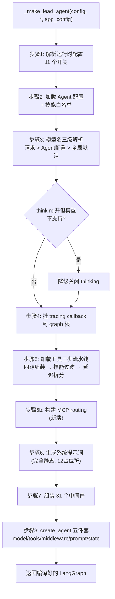
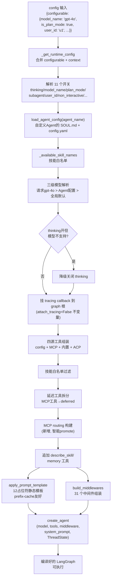

# 第 2 章：Agent 工厂 —— Lead Agent 是怎么被造出来的（极致详细版）

> **本章目标**：把 `_make_lead_agent` 这 210 行代码**每一行都讲透**。读完本章，你不看源码也能回答：一个配置字典怎么变成可执行的 LangGraph？模型怎么选的？工具哪来的？31 个中间件怎么组装的？系统提示词怎么生成的？为什么这么设计？
>
> 本章是第 1 章"阶段 ⑤ 构建 Agent"（worker.py 第 355-426 行）的放大。

---

## 2.1 全局视角：两层工厂调用链

Agent 的创建不是一步完成的，而是**两层工厂**接力：

```
run_agent worker (worker.py:411)
    │
    │  agent = agent_factory(config=runnable_config, app_config=...)
    │         ↑ agent_factory 就是 make_lead_agent
    ▼
make_lead_agent(config)                    ← 第 1 层：薄壳，4 行
    │  负责：判断用哪个 app_config
    │  return _make_lead_agent(config, app_config=...)
    ▼
_make_lead_agent(config, *, app_config)    ← 第 2 层：真正干活，约 210 行
    │  负责：解析配置 → 选模型 → 加载工具 → 组装中间件 → 生成提示词 → create_agent
    │  return create_agent(model, tools, middleware, system_prompt, state_schema)
    ▼
编译好的 LangGraph（可执行的图）
```

**为什么要分两层？** 因为 `app_config`（应用配置）有两个来源，需要一层来"决策用哪个"：

| 来源 | 场景 | 怎么来的 |
|------|------|----------|
| 全局单例 `get_app_config()` | HTTP 请求 | 启动时从 `config.yaml` 加载，缓存在全局 |
| 请求级覆盖 | 嵌入式调用（`DeerFlowClient`）、测试 | 调用方显式传入，可以"这次 run 用不同配置" |

第 1 层负责判断"有没有请求级覆盖"，把决策结果传给第 2 层。第 2 层是纯粹的组装逻辑，不关心 app_config 哪来的——这种分离让第 2 层可以独立测试。

---

## 2.2 第 1 层：make_lead_agent —— 4 行的薄壳

```python
# 引用位置：backend/packages/harness/deerflow/agents/lead_agent/agent.py:421-425
def make_lead_agent(config: RunnableConfig):
    """LangGraph graph factory; keep the signature compatible with LangGraph Server."""
    runtime_config = _get_runtime_config(config)
    runtime_app_config = runtime_config.get("app_config")
    return _make_lead_agent(config, app_config=runtime_app_config or get_app_config())
```

**► 逐行注解**：

- **第 422 行 docstring**："LangGraph graph factory; keep the signature compatible with LangGraph Server."——这句话是**对修改者的警告**。这个函数注册在 `backend/langgraph.json` 里，LangGraph Server 用固定签名 `(config)` 调用它。**即使需要 app_config，也不能加成显式参数**，否则 LangGraph Server 调不动。

- **第 423 行 `_get_runtime_config(config)`**：合并运行时配置（下节详解）。

- **第 424 行 `runtime_config.get("app_config")`**：调用方可以把请求级 app_config 塞进 `config["configurable"]["app_config"]`。如果没有，返回 `None`。

- **第 425 行 `runtime_app_config or get_app_config()`**：**`or` 的短路语义**——只有当 `runtime_app_config` 为 falsy（None）时才调用 `get_app_config()`。这避免了不必要的全局查找（`get_app_config()` 内部有缓存逻辑，但仍是一次函数调用 + 字典查找）。

**数据流样例**：
```python
# 场景 A：普通 HTTP 请求（无请求级覆盖）
config = {"configurable": {"thread_id": "t1", "model_name": "doubao"}, "context": {...}}
runtime_config = {"thread_id": "t1", "model_name": "doubao", ...}  # 合并后
runtime_app_config = None  # 没传 app_config
# → 用 get_app_config() 全局单例

# 场景 B：嵌入式调用（DeerFlowClient 传入请求级配置）
config = {"configurable": {"app_config": custom_config, ...}}
runtime_app_config = custom_config  # 有！
# → 用 custom_config，不走全局
```

---

## 2.3 辅助函数：_get_runtime_config —— 合并两套配置源

在进入第 2 层之前，先看这个被频繁调用的辅助函数：

```python
# 引用位置：backend/packages/harness/deerflow/agents/lead_agent/agent.py:84-90
def _get_runtime_config(config: RunnableConfig) -> dict:
    """Merge legacy configurable options with LangGraph runtime context."""
    cfg = dict(config.get("configurable", {}) or {})
    context = config.get("context", {}) or {}
    if isinstance(context, dict):
        cfg.update(context)
    return cfg
```

**► 逐行注解**：

- **第 86 行 `cfg = dict(config.get("configurable", {}) or {})`**：取出 `configurable` 并**复制**（`dict(...)` 创建新字典，不修改原 config）。`or {}` 是防御——如果 `configurable` 是 `None`，用空字典。

- **第 87 行 `context = config.get("context", {}) or {}`**：取出 `context`。这是 LangGraph 新引入的字段。

- **第 88-89 行 `cfg.update(context)`**：**context 覆盖 configurable**。如果有同名 key，context 的值赢。

**为什么要合并两套？设计动机深挖**：

LangGraph 的配置经历了演进：
- **旧版**：运行时参数放 `config["configurable"]`（比如 `model_name`、`thread_id`）。
- **新版**：引入了 `config["context"]`，用于"运行时上下文"（和 checkpointer 无关的参数）。

DeerFlow 的运行时参数（`thinking_enabled`、`is_plan_mode` 等）在两个地方都可能出现——取决于调用方（前端 SDK、IM 渠道、嵌入式客户端）走哪条路。**合并**（context 覆盖 configurable）保证不管放哪都能读到，且 context 优先级更高（语义上 context 是"更明确的运行时指定"）。

**数据流样例**：
```python
config = {
    "configurable": {"thread_id": "t1", "model_name": "gpt-4o"},  # configurable 里的
    "context": {"model_name": "doubao", "thinking_enabled": True}, # context 里的（覆盖）
}
# 合并后：
cfg = {"thread_id": "t1", "model_name": "doubao", "thinking_enabled": True}
#                                        ↑ context 赢
```

---

## 2.4 第 2 层：_make_lead_agent 的五大步骤总览

`_make_lead_agent`（`agent.py:428-639`，约 210 行）做五件事：



下面逐步剖析。

---

### 步骤 1：解析运行时配置（11 个开关，3 个新增）

```python
# 引用位置：backend/packages/harness/deerflow/agents/lead_agent/agent.py:434-454
    cfg = _get_runtime_config(config)
    resolved_app_config = app_config

    # Extract user_id for user-scoped skill loading.
    # LangGraph gateway injects user_id into config["configurable"];
    # fall back to the runtime contextvar when not present.
    from deerflow.runtime.user_context import get_effective_user_id

    runtime_user_id = cfg.get("user_id")
    resolved_user_id = str(runtime_user_id) if runtime_user_id else get_effective_user_id()

    thinking_enabled = cfg.get("thinking_enabled", True)
    reasoning_effort = cfg.get("reasoning_effort", None)
    requested_model_name: str | None = cfg.get("model_name") or cfg.get("model")
    is_plan_mode = cfg.get("is_plan_mode", False)
    subagent_enabled = cfg.get("subagent_enabled", False)
    max_concurrent_subagents = cfg.get("max_concurrent_subagents", 3)
    max_total_subagents = cfg.get("max_total_subagents", _default_max_total_subagents(resolved_app_config))
    is_bootstrap = cfg.get("is_bootstrap", False)
    non_interactive = bool(cfg.get("non_interactive", False))
    agent_name = validate_agent_name(cfg.get("agent_name"))
```

**► 逐行注解**：

- **第 437-443 行 `resolved_user_id`**（新增）：显式解析用户身份。
  ```python
  runtime_user_id = cfg.get("user_id")           # Gateway 注入的认证用户
  resolved_user_id = str(runtime_user_id) if runtime_user_id else get_effective_user_id()
  ```
  **为什么需要显式解析？** LangGraph Gateway 会把认证用户的 id 注入 `config["configurable"]["user_id"]`。但嵌入式调用（DeerFlowClient）不走 Gateway，没有这个注入，要回退到 `get_effective_user_id()` ContextVar。`str(...)` 强制转换——有些地方的 user_id 可能是 UUID 对象而非字符串。
  **这个 user_id 贯穿后续**：技能白名单（per-user 自定义技能）、MCP routing 的 per-user 配置。

- **第 447 行 `requested_model_name = cfg.get("model_name") or cfg.get("model")`**：`model_name` 和 `model` 是**别名**。优先 `model_name`，空则回退 `model`。`or` 保证空字符串也回退。

- **第 451 行 `max_total_subagents`**（新增）：
  ```python
  max_total_subagents = cfg.get("max_total_subagents", _default_max_total_subagents(resolved_app_config))
  ```
  调 `_default_max_total_subagents`（`agent.py:66-68`）取默认值：
  ```python
  def _default_max_total_subagents(app_config: object) -> int:
      subagents_config = getattr(app_config, "subagents", None)
      return getattr(subagents_config, "max_total_per_run", DEFAULT_MAX_TOTAL_SUBAGENTS_PER_RUN)
  ```
  **这是目标延续循环的安全阀**。旧版只有"单次响应并发上限"（`max_concurrent_subagents`）。目标延续循环加入后，Agent 可能在多轮续轮里无限委派子 Agent——`max_total_subagents` 限制**整个 run 累计**的子 Agent 总数。

- **第 453 行 `non_interactive`**（新增）：`bool(cfg.get("non_interactive", False))`。IM 渠道、Webhook、定时任务等场景**无法向用户提问**。开启后后续会过滤掉 `ask_clarification` 工具。`bool(...)` 强制布尔化（防御性编程）。

- **第 454 行 `agent_name = validate_agent_name(...)`**：校验自定义 Agent 名。`validate_agent_name` 会检查格式（防路径穿越——因为 Agent 配置会写到文件系统 `users/{user_id}/agents/{agent_name}/`，恶意 agent_name 如 `../../etc` 会越权写文件）。

**设计动机深挖——为什么用 `cfg.get(key, default)` 而非 `cfg[key]`？**

所有配置都用 `get` 带默认值，而不是直接 `cfg[key]`。原因：**运行时配置是"可选覆盖"**，大部分调用方不会传所有 11 个 key。用 `get` + 默认值保证"不传就用默认"，而非 KeyError 崩溃。这是 API 设计的**鲁棒性原则**：对调用方宽容。

---

### 步骤 2：加载 Agent 配置 + 技能白名单

```python
# 引用位置：backend/packages/harness/deerflow/agents/lead_agent/agent.py:456-459
    agent_config = load_agent_config(agent_name) if not is_bootstrap else None
    available_skills = _available_skill_names(agent_config, is_bootstrap)
    # Custom agent model from agent config (if any), or None to let _resolve_model_name pick the default
    agent_model_name = agent_config.model if agent_config and agent_config.model else None
```

**► 逐行注解**：

- **`load_agent_config(agent_name)`**：如果指定了 `agent_name`（比如用户创建了叫 `data-analyst` 的自定义 Agent），从文件系统加载它的配置（`SOUL.md` + `config.yaml`）。bootstrap 模式跳过——因为 bootstrap 是"创建 Agent 之前"的引导流程，Agent 还不存在。

  **数据流样例**：
  ```python
  # 自定义 Agent 的配置长这样（存在 users/{uid}/agents/data-analyst/config.yaml）
  agent_config = AgentConfig(
      model="doubao-seed-2-0-code",
      skills=["data-analysis", "report-generation"],  # 这个Agent只能用这两个技能
      tool_groups=["sandbox", "community"],             # 只用沙箱和社区工具组
  )
  ```

- **`available_skills = _available_skill_names(agent_config, is_bootstrap)`**：计算这个 Agent 被允许用哪些技能。逻辑（`agent.py:398-404`）：
  - bootstrap → 只用 `{"bootstrap"}` 集合。
  - 自定义 Agent 配置了 `skills` → 用配置的白名单。
  - 没配置 → `None`（表示"全部可用"）。

  **`None` vs 空集的语义区别**（重要）：`None` = 不限制（所有 public 技能都可用）；空集 `set()` = 禁用所有技能。这个区别在后续的 `_load_enabled_skills_for_tool_policy` 里有不同处理。

- **`agent_model_name`**：自定义 Agent 可以指定自己的默认模型。`agent_config and agent_config.model` 双重判断——先确认 `agent_config` 非 None，再取 `model`。

---

### 步骤 3：模型名三级解析（核心设计！）

这是 DeerFlow 里一个精巧的设计。模型偏好有三个来源，优先级如何？

```python
# 引用位置：backend/packages/harness/deerflow/agents/lead_agent/agent.py:461-470
    # Final model name resolution: request → agent config → global default, with fallback for unknown names
    model_name = _resolve_model_name(requested_model_name or agent_model_name, app_config=resolved_app_config)

    model_config = resolved_app_config.get_model_config(model_name)

    if model_config is None:
        raise ValueError("No chat model could be resolved. Please configure at least one model in config.yaml or provide a valid 'model_name'/'model' in the request.")
    if thinking_enabled and not model_config.supports_thinking:
        logger.warning(f"Thinking mode is enabled but model '{model_name}' does not support it; fallback to non-thinking mode.")
        thinking_enabled = False
```

**► 逐行注解**：

- **第 461 行**：`requested_model_name or agent_model_name`——**请求级**（用户在前端选的）优先于 **Agent 配置级**（自定义 Agent 设的默认）。然后传给 `_resolve_model_name`，它再加一层"全局默认"兜底。

  **最终优先级链**：**请求 > Agent 配置 > 全局默认**。

看 `_resolve_model_name` 的兜底逻辑：

```python
# 引用位置：backend/packages/harness/deerflow/agents/lead_agent/agent.py:93-105
def _resolve_model_name(requested_model_name: str | None = None, *, app_config: AppConfig | None = None) -> str:
    """Resolve a runtime model name safely, falling back to default if invalid. Returns None if no models are configured."""
    app_config = app_config or get_app_config()
    default_model_name = app_config.models[0].name if app_config.models else None
    if default_model_name is None:
        raise ValueError("No chat models are configured. Please configure at least one model in config.yaml.")

    if requested_model_name and app_config.get_model_config(requested_model_name):
        return requested_model_name

    if requested_model_name and requested_model_name != default_model_name:
        logger.warning(f"Model '{requested_model_name}' not found in config; fallback to default model '{default_model_name}'.")
    return default_model_name
```

**► 逐行注解**：

- **第 96 行 `default_model_name = app_config.models[0].name`**：全局默认模型 = `config.yaml` 里 `models` 列表的**第一个**。**所以配置文件里模型的顺序有意义**——第一个是默认。

- **第 100-101 行**：请求的模型名**存在且在白名单里** → 用请求的。

- **第 103-104 行**：请求的模型名**不在白名单**（拼错了？没配置？）→ **不报错，降级到默认模型**并记 warning。

**设计动机深挖——为什么"降级"而非"报错"？**

```
对比两种策略：
  策略 A（严格）：模型名不在白名单 → 抛 ValueError → run 失败
  策略 B（宽容）：模型名不在白名单 → 用默认模型 + 记 warning → run 继续

DeerFlow 选 B。为什么？
  - Agent 是长流程任务（可能跑几分钟），中途因模型名拼错而崩溃，体验极差
  - 用户可能在前端选了一个"刚下线的模型"，与其报错，不如用默认模型继续
  - warning 日志方便事后排查
```

但这不代表完全不校验——`start_run`（第 1 章阶段②步骤2）在**进入工厂前**就做了严格白名单校验（不在白名单 → 400 拒绝）。工厂里的降级是"最后防线"，处理"白名单校验后、模型又被改了"的极端竞态。

**完整的三级解析数据流**：
```python
# config.yaml: models: [{name: "doubao"}, {name: "gpt-4o"}, {name: "qwen"}]

# 场景1: 用户请求指定了 model_name="gpt-4o"
requested_model_name = "gpt-4o"
agent_model_name = None
# → _resolve_model_name("gpt-4o") → 白名单有 → 返回 "gpt-4o"

# 场景2: 用户没指定，自定义 Agent 配置了 model="qwen"
requested_model_name = None
agent_model_name = "qwen"
# → _resolve_model_name("qwen") → 白名单有 → 返回 "qwen"

# 场景3: 用户指定了 model_name="claude"（不在白名单）
requested_model_name = "claude"
# → _resolve_model_name("claude") → 白名单没有 → warning → 返回 "doubao"(默认)

# 场景4: 都没指定
requested_model_name = None
agent_model_name = None
# → _resolve_model_name(None) → 返回 "doubao"(默认)
```

- **第 466-470 行 thinking 兼容性检查**：如果开了思维链但模型**不支持**（`supports_thinking=False`，比如某些小模型），**不报错，降级关闭** thinking 并记 warning。

  **设计动机**：和模型解析同理——**优雅降级**而非硬失败。用户开了 thinking，模型不支持，继续跑（只是没思维链）比崩溃好。

---

### 步骤 4：注入 LangSmith trace 元数据

```python
# 引用位置：backend/packages/harness/deerflow/agents/lead_agent/agent.py:484-499
    # Inject run metadata for LangSmith trace tagging
    if "metadata" not in config:
        config["metadata"] = {}

    config["metadata"].update(
        {
            "agent_name": agent_name or "default",
            "model_name": model_name or "default",
            "thinking_enabled": thinking_enabled,
            "reasoning_effort": reasoning_effort,
            "is_plan_mode": is_plan_mode,
            "subagent_enabled": subagent_enabled,
            "tool_groups": agent_config.tool_groups if agent_config else None,
            "available_skills": sorted(available_skills) if available_skills is not None else None,
        }
    )
```

**► 注解**：把这些运行时信息写到 `config["metadata"]`，LangSmith 会把它们作为 trace 的 tag。这样在 LangSmith 面板可以按 `model_name=gpt-4o` 或 `thinking_enabled=true` 过滤 trace。

---

### 步骤 5：注入 tracing callback（关键不变量！）

```python
# 引用位置：backend/packages/harness/deerflow/agents/lead_agent/agent.py:501-512
    # Inject tracing callbacks at the graph invocation root so a single LangGraph
    # run produces one trace with all node / LLM / tool calls as child spans,
    # AND so the Langfuse handler sees ``on_chain_start(parent_run_id=None)`` and
    # actually propagates ``langfuse_session_id`` / ``langfuse_user_id`` from
    # ``config["metadata"]`` onto the trace. Without root-level attachment the
    # model is a nested observation and the handler strips ``langfuse_*`` keys.
    tracing_callbacks = build_tracing_callbacks()
    if tracing_callbacks:
        existing = config.get("callbacks") or []
        if not isinstance(existing, list):
            existing = list(existing)
        config["callbacks"] = [*existing, *tracing_callbacks]
```

**► 逐行注解 + 设计动机深挖**（这是 DeerFlow 最重要的不变量之一）：

**问题背景**：Langfuse/LangSmith 通过 LangChain 的 callback 机制收集 trace。callback 可以挂在两个地方：
1. **挂在 model 上**（`model.callbacks = [...]`）
2. **挂在 graph 根上**（`config["callbacks"] = [...]`）

如果挂错了地方，会有两个严重问题：

**问题 1：重复 span**。同一 LLM 调用既被 model callback 记录，又被 graph callback 记录，产生重复 trace 节点——统计翻倍，trace 冗余。

**问题 2（更严重）：Langfuse 属性丢失**。Langfuse handler 有个 `propagate_attributes` 机制，它**只有**在看到 `on_chain_start(parent_run_id=None)`（即根调用）时，才把 `session_id`、`user_id` 这些 trace 属性"提升"到根 trace 上。如果 callback 挂在 model 上，model 是个**嵌套** observation（`parent_run_id != None`），handler 会**丢弃** `langfuse_*` 属性——结果你在 Langfuse 面板看不到 session/user 分组。

**解决方案**（注释说得很清楚）：**只在 graph 根挂 callback**。所有 `create_chat_model` 调用都传 `attach_tracing=False`。这样一次 run 产生一棵单一的 trace 树。

**文件顶部的 INVARIANT 警告**（`agent.py:1-19`）把这条规则列为不变量——修改者必须遵守。当前有 4 个 `create_chat_model` 调用点（bootstrap agent、默认 agent、summarization middleware、TitleMiddleware 的 async 路径），全部传 `attach_tracing=False`。

**第 509-512 行的合并逻辑**：`[*existing, *tracing_callbacks]`——**追加**而非覆盖。如果调用方已经有 callback（比如嵌入式客户端自己挂的），不丢掉它们。

---

### 步骤 6：加载工具三步流水线 + MCP routing（核心！）

这是最复杂的一步。工具加载是**三步流水线 + 额外两步**：

```python
# 引用位置：backend/packages/harness/deerflow/agents/lead_agent/agent.py:514, 576-612
    skills_for_tool_policy = _load_enabled_skills_for_tool_policy(available_skills, app_config=resolved_app_config, user_id=resolved_user_id)

    # ... bootstrap 分支略，看默认分支 ...

    # 步骤 A: 技能搜索构建（延迟技能发现）
    skill_setup = build_skill_search_setup(skills_for_tool_policy, enabled=skill_search_enabled, container_base_path=container_base_path)

    # 步骤 B: webhook 限制
    channel_name = cfg.get("channel_name")
    is_webhook_channel = channel_name in _WEBHOOK_CHANNELS
    extra_tools = [update_agent] if agent_name and not is_webhook_channel else []

    # 步骤 C: 四源组装
    raw_tools = get_available_tools(model_name=model_name, groups=agent_config.tool_groups if agent_config else None, subagent_enabled=subagent_enabled, app_config=resolved_app_config)

    # 步骤 D: 技能白名单过滤
    filtered = filter_tools_by_skill_allowed_tools(raw_tools + extra_tools, skills_for_tool_policy, always_allowed_tool_names=ALWAYS_AVAILABLE_BUILTIN_TOOL_NAMES)

    # 步骤 E: non_interactive 过滤
    if non_interactive:
        filtered = [tool for tool in filtered if tool.name not in _NON_INTERACTIVE_DISABLED_TOOL_NAMES]

    # 步骤 F: 延迟工具拆分
    final_tools, setup = assemble_deferred_tools(filtered, enabled=resolved_app_config.tool_search.enabled)

    # 步骤 G: MCP routing 构建（新增）
    mcp_routing_middleware = build_mcp_routing_middleware(final_tools, setup, top_k=resolved_app_config.tool_search.auto_promote_top_k)
    mcp_routing_hints_section = get_mcp_routing_hints_prompt_section(filtered, deferred_names=setup.deferred_names)

    # 步骤 H: 追加 describe_skill 和 memory 工具
    if skill_setup.describe_skill_tool:
        final_tools.append(skill_setup.describe_skill_tool)
    if should_use_memory_tools(resolved_app_config.memory):
        _append_memory_tools_without_name_conflicts(final_tools)
```

**► 逐步注解**：

#### 步骤 A-B：技能策略 + webhook 限制

- **`_load_enabled_skills_for_tool_policy(available_skills, ..., user_id=resolved_user_id)`**：加载技能的策略信息（每个技能的 `allowed-tools` 白名单）。新增 `user_id` 支持 per-user 自定义技能。

- **webhook 限制**（第 582-596 行，注释极其重要）：
  ```python
  channel_name = cfg.get("channel_name")
  is_webhook_channel = channel_name in _WEBHOOK_CHANNELS  # _WEBHOOK_CHANNELS = {"github"}
  extra_tools = [update_agent] if agent_name and not is_webhook_channel else []
  ```
  **设计动机深挖**（注释原文翻译）：Webhook（目前只有 GitHub）的 prompt 来自**任意外部评论者**——任何能在配置的 repo 上发评论并 `@<bot>` 的人都能触发。如果把 `update_agent` 工具暴露给 webhook，那个评论者就能修改 Agent 的 `tool_groups`/`SOUL.md`/`model`，而且这个修改**对所有后续 run 持久生效**。所以 self-mutation（自我修改）只允许在**可信渠道**（聊天 UI、HTTP API），不允许在 webhook 扇出里。

  **安全设计原则：不可信输入源不能获得持久化写权限。**

#### 步骤 C-D：四源组装 + 技能白名单过滤

- **`get_available_tools(...)`**：从四个来源组装工具（**细节是第 4 章主题**）：
  1. **config 工具**：`config.yaml` 的 `tools[]` 配置。
  2. **MCP 工具**：MCP 服务器提供的工具。
  3. **内置工具**：`present_files`、`ask_clarification` 等。
  4. **ACP 工具**：外部 Agent 协议工具。

- **`filter_tools_by_skill_allowed_tools(...)`**：按技能白名单过滤。有些技能会限制"只能用某些工具"，这里强制执行。`always_allowed_tool_names=ALWAYS_AVAILABLE_BUILTIN_TOOL_NAMES` 保证某些核心工具（如 `present_files`）不被过滤掉。

#### 步骤 E：non_interactive 过滤

- **第 600-601 行**：`if non_interactive: filtered = [tool for tool in filtered if tool.name not in _NON_INTERACTIVE_DISABLED_TOOL_NAMES]`。IM/Webhook/定时任务场景，过滤掉 `ask_clarification`——这些场景无法向用户提问，如果 Agent 调用了澄清工具会卡死。

#### 步骤 F：延迟工具拆分

- **`assemble_deferred_tools(filtered, enabled=...)`**：把 MCP 工具拆出来标记为 "deferred"（延迟）。返回 `(final_tools, setup)`：
  - `final_tools`：非延迟工具（立即可用）+ 延迟工具的**占位**（ToolNode 持有但模型看不到 schema）。
  - `setup.deferred_names`：延迟工具名集合。
  - `setup.catalog_hash`：工具目录指纹（用于检测配置变更）。

  **设计动机**：MCP 服务器可能提供几十上百个工具，全部塞进模型上下文会：(1) 浪费 token；(2) 干扰模型选择。延迟机制让模型先用 `tool_search` 发现需要的工具。

#### 步骤 G：MCP routing 构建（新增）

```python
mcp_routing_middleware = build_mcp_routing_middleware(final_tools, setup, top_k=resolved_app_config.tool_search.auto_promote_top_k)
mcp_routing_hints_section = get_mcp_routing_hints_prompt_section(filtered, deferred_names=setup.deferred_names)
```

**► 注解**：
- **`build_mcp_routing_middleware`**：根据工具元数据构建智能路由中间件。让模型在调用 MCP 工具前**自动发现并 promote**相关的延迟工具，不需要手动 `tool_search`。
- **`top_k`**：自动 promote 的工具数量上限（防止一次性 promote 太多又撑爆上下文）。
- **`get_mcp_routing_hints_prompt_section`**：生成系统提示词里的 MCP routing 提示段。
- **如果路由索引构建失败（元数据不足），返回 `None`**——中间件不存在，退化为旧版手动 `tool_search` 行为。**优雅降级**。

#### 步骤 H：追加 describe_skill 和 memory 工具

```python
if skill_setup.describe_skill_tool:
    final_tools.append(skill_setup.describe_skill_tool)
if should_use_memory_tools(resolved_app_config.memory):
    _append_memory_tools_without_name_conflicts(final_tools)
```

**► 注解**：
- **`describe_skill_tool`**：延迟技能发现启用时，提供 `describe_skill` 工具让模型按需查看技能详情。
- **`_append_memory_tools_without_name_conflicts`**（`agent.py:71-81`）：如果记忆系统配置为"工具模式"，追加记忆工具。**注意函数名里的 "without_name_conflicts"**——它检查重名，避免记忆工具覆盖已有同名工具：
  ```python
  def _append_memory_tools_without_name_conflicts(tools: list) -> None:
      existing_names = {getattr(tool, "name", None) for tool in tools}
      for memory_tool in get_memory_tools():
          if memory_tool.name in existing_names:
              logger.warning("Memory tool name %r already exists and was skipped.", memory_tool.name)
              continue
          tools.append(memory_tool)
          existing_names.add(memory_tool.name)
  ```
  **为什么需要这个？** 记忆工具可能叫 `recall_memory`，但某个 MCP 服务器也提供了同名工具。直接 append 会导致重名冲突。这个函数跳过重名的，记 warning。

---

### 步骤 7-8：生成提示词 + 组装中间件 + create_agent

```python
# 引用位置：backend/packages/harness/deerflow/agents/lead_agent/agent.py:613-639 (默认分支)
    return create_agent(
        model=create_chat_model(name=model_name, thinking_enabled=thinking_enabled, reasoning_effort=reasoning_effort, app_config=resolved_app_config, attach_tracing=False),
        tools=final_tools,
        middleware=build_middlewares(
            config,
            model_name=model_name,
            agent_name=agent_name,
            available_skills=available_skills,
            app_config=resolved_app_config,
            deferred_setup=setup,
            mcp_routing_middleware=mcp_routing_middleware,
            user_id=resolved_user_id,
        ),
        system_prompt=apply_prompt_template(
            subagent_enabled=subagent_enabled,
            max_concurrent_subagents=max_concurrent_subagents,
            max_total_subagents=max_total_subagents,
            agent_name=agent_name,
            available_skills=available_skills,
            app_config=resolved_app_config,
            deferred_names=setup.deferred_names,
            mcp_routing_hints_section=mcp_routing_hints_section,
            user_id=resolved_user_id,
            skill_names=skill_setup.skill_names or None,
        ),
        state_schema=ThreadState,
    )
```

**► 注解**：`create_agent` 是 LangChain 的工厂函数，5 个参数对应 Agent 五大组成：

| 参数 | 内容 | 来源 |
|------|------|------|
| `model` | LLM 实例 | `create_chat_model(...)`，注意 `attach_tracing=False` |
| `tools` | 工具列表 | 步骤 6 的 `final_tools` |
| `middleware` | 31 个中间件 | `build_middlewares(...)`（第 3 章主题） |
| `system_prompt` | 系统提示词 | `apply_prompt_template(...)` |
| `state_schema` | 状态 schema | `ThreadState`（第 1 章 1.5 节） |

**返回值**：编译好的 LangGraph——一个可执行的图，worker 调 `agent.astream(input)` 就能流式执行。

---

## 2.5 系统提示词生成：apply_prompt_template（完全静态！）

### 设计哲学（最重要！）

```python
# 引用位置：backend/packages/harness/deerflow/agents/lead_agent/prompt.py:1039-1042 (注释)
    # Build and return the fully static system prompt.
    # Memory and current date are injected per-turn via DynamicContextMiddleware
    # as a <system-reminder> in the first HumanMessage, keeping this prompt
    # identical across users and sessions for maximum prefix-cache reuse.
```

**► 设计动机深挖——为什么系统提示词必须完全静态？**

**答案：prefix-cache（前缀缓存）复用。**

LLM 提供商（OpenAI、Anthropic）对请求做**前缀缓存**：如果两次请求的前 N 个 token 完全相同，第二次能复用缓存的 KV（key-value）状态，**省算力、降延迟、降成本**。

```
请求 A（2026-07-15）:
  System: "你是DeerFlow...今天是 2026-07-15..."
  Human: "帮我分析数据"

请求 B（2026-07-16）:
  System: "你是DeerFlow...今天是 2026-07-16..."  ← 日期变了！
  Human: "继续"

  → 前缀不同了，缓存失效！每次都要重新计算前几千 token 的 KV。
```

DeerFlow 的解决方案：**系统提示词完全静态**（不含日期、不含记忆、不含任何易变内容）。易变内容由 `DynamicContextMiddleware` 作为 `<system-reminder>` 注入到**首条 HumanMessage**（第 3 章详解）。这样系统提示词可以长期缓存。

### 函数签名（12 个参数）

```python
# 引用位置：backend/packages/harness/deerflow/agents/lead_agent/prompt.py:973-985
def apply_prompt_template(
    subagent_enabled: bool = False,
    max_concurrent_subagents: int = 3,
    max_total_subagents: int | None = None,           # 新增
    *,
    agent_name: str | None = None,
    available_skills: set[str] | None = None,
    app_config: AppConfig | None = None,
    deferred_names: frozenset[str] = frozenset(),
    mcp_routing_hints_section: str = "",              # 新增
    user_id: str | None = None,                        # 新增
    skill_names: frozenset[str] | None = None,         # 新增（延迟技能发现）
) -> str:
```

### 模板填充

```python
# 引用位置：backend/packages/harness/deerflow/agents/lead_agent/prompt.py:1043-1056
    return SYSTEM_PROMPT_TEMPLATE.format(
        agent_name=agent_name or "DeerFlow 2.0",
        soul=get_agent_soul(agent_name),
        self_update_section=_build_self_update_section(agent_name),
        skills_section=skills_section,
        deferred_tools_section=deferred_tools_section,
        mcp_routing_hints_section=mcp_routing_hints_section,
        subagent_section=subagent_section,
        memory_tool_section=...,                        # 新增
        subagent_reminder=subagent_reminder,
        skill_first_reminder=...,                       # 新增
        subagent_thinking=subagent_thinking,
        acp_section=acp_and_mounts_section,
    )
```

**► 注解**：`SYSTEM_PROMPT_TEMPLATE` 是一个带 12 个占位符的大字符串（`prompt.py:471-695`）。`str.format()` 填充它们。各个 section 的条件性组装——**只包含相关的部分**，减少冗余。

### subagent_reminder：并发控制双闸的"软闸"

```python
# 引用位置：backend/packages/harness/deerflow/agents/lead_agent/prompt.py (subagent_reminder 构建逻辑)
    subagent_reminder = (
        "- **Orchestrator Mode**: You are a task orchestrator - decompose complex tasks into parallel sub-tasks. "
        f"**HARD LIMIT: max {n} `task` calls per response.** "
        f"If >{n} sub-tasks, split into sequential batches of ≤{n}. Synthesize after ALL batches complete.\n"
        if subagent_enabled
        else ""
    )
```

**► 设计动机——"双闸控制"模式**：

这是"软约束"——**靠 prompt 告诉模型"最多 N 个并发"**。但 LLM 不一定听话，可能在一次响应里发起 5 个 task 调用。

所以还有**硬约束**：`SubagentLimitMiddleware`（第 3 章）在代码层面**截断**超出 N 个的 task 调用。

**为什么需要双闸？** 因为 LLM 是不可靠的——**永远不要只靠 prompt 来保证不变量，代码层面必须有兜底**。prompt 告诉模型"该怎么做"（减少违规概率），middleware 保证"万一违规了强制纠正"。

---

## 2.6 _make_lead_agent 完整流程的数据流总览



---

## 2.7 本章小结

现在你理解了 Agent 工厂的**每一行代码**：

1. **两层工厂**：`make_lead_agent`（决策 app_config 来源）→ `_make_lead_agent`（210 行组装）。
2. **11 个运行时开关**：3 个新增（`user_id`/`max_total_subagents`/`non_interactive`），各自的安全/功能动机。
3. **模型三级解析**：请求 > Agent 配置 > 全局默认，"降级而非报错"的设计哲学。
4. **tracing 在 graph 根注入**：避免重复 span 和 Langfuse 属性丢失，是强制不变量。
5. **工具八步流水线**：四源组装 → webhook 限制 → 技能过滤 → non_interactive 过滤 → 延迟拆分 → MCP routing → describe_skill → memory 工具。
6. **系统提示词完全静态**：为 prefix-cache 复用，易变内容交给 DynamicContextMiddleware。
7. **双闸并发控制**：prompt 软约束 + middleware 硬截断。

**核心思想**：Agent 是**每次 run 按请求动态组装**的（非单例），这样才能根据运行时参数定制。但系统提示词刻意静态，把易变内容外移到中间件层。**动态组装 + 静态提示词**是 DeerFlow 性能和灵活性的平衡点。

**下一章**：钻进 `build_middlewares` 返回的 31 个中间件——这是理解 Agent "内部行为"的关键。
