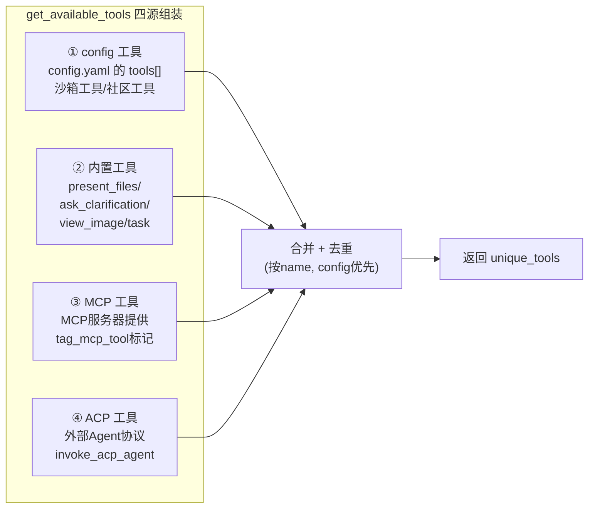

# 第 4 章：工具系统 —— Agent 手里的工具是怎么来的

> **本章目标**：讲透 `get_available_tools` 的完整实现。读完本章，你会理解 Agent 手里的每一个工具从哪来（四个来源）、怎么组装（去重/过滤）、为什么这样设计。每个内置工具、社区工具、ACP 工具都会讲到。
>
> 本章是第 2 章"步骤 6 加载工具"的放大。

---

## 4.1 全局视角：工具的四个来源

Agent 的工具不是写死的，而是运行时从**四个来源**组装：



**为什么是四个来源？** 因为 DeerFlow 是 harness（运行时），要支持多种扩展方式：
- **config 工具**：用户在 `config.yaml` 里声明的工具（最常见）。
- **内置工具**：框架自带的、不可关闭的核心工具。
- **MCP 工具**：通过 MCP 协议接入的外部工具（标准化扩展）。
- **ACP 工具**：通过 ACP 协议接入的外部 Agent（另一个扩展通道）。

---

## 4.2 get_available_tools 完整代码逐行剖析

```python
# 引用位置：backend/packages/harness/deerflow/tools/tools.py:45-177
def get_available_tools(
    groups: list[str] | None = None,
    include_mcp: bool = True,
    model_name: str | None = None,
    subagent_enabled: bool = False,
    *,
    app_config: AppConfig | None = None,
) -> list[BaseTool]:
    """Get all available tools from config."""
    config = app_config or get_app_config()
```

**► 注解**：函数签名有 5 个参数，每个都控制工具集的某个维度：
- **`groups`**：工具组过滤。自定义 Agent 可以配置只使用某些工具组。
- **`include_mcp`**：是否包含 MCP 工具（默认 True）。bootstrap 等场景可能不需要。
- **`model_name`**：决定是否加入 `view_image_tool`（只有视觉模型才加）。
- **`subagent_enabled`**：决定是否加入 `task` 工具（子 Agent 委派）。
- **`app_config`**：显式传入配置（嵌入式调用场景）。

### 步骤 1：加载 config 工具

```python
# 引用位置：backend/packages/harness/deerflow/tools/tools.py:67-89
    config = app_config or get_app_config()
    tool_configs = [tool for tool in config.tools if groups is None or tool.group in groups]

    # Do not expose host bash by default when LocalSandboxProvider is active.
    if not is_host_bash_allowed(config):
        tool_configs = [tool for tool in tool_configs if not _is_host_bash_tool(tool)]

    loaded_tools_raw = [(cfg, resolve_variable(cfg.use, BaseTool)) for cfg in tool_configs]

    # Warn when the config ``name`` field and the tool object's ``.name``
    # attribute diverge — this mismatch is the root cause of issue #1803 where
    # the LLM receives one name in its tool schema but the runtime router
    # recognises a different name, producing "not a valid tool" errors.
    for cfg, loaded in loaded_tools_raw:
        if cfg.name != loaded.name:
            logger.warning(
                "Tool name mismatch: config name %r does not match tool .name %r (use: %s). The tool's own .name will be used for binding.",
                cfg.name,
                loaded.name,
                cfg.use,
            )

    loaded_tools = [_ensure_sync_invocable_tool(t) for _, t in loaded_tools_raw]
```

**► 逐行注解**：

- **第 68 行 `tool_configs = [tool for tool in config.tools if groups is None or tool.group in groups]`**：从 `config.yaml` 的 `tools[]` 列表过滤。如果传了 `groups`（自定义 Agent 的工具组），只保留属于这些组的工具。`groups is None` 表示不过滤（默认 Agent 用全部）。

- **第 70-72 行 host bash 安全过滤**：
  ```python
  if not is_host_bash_allowed(config):
      tool_configs = [tool for tool in tool_configs if not _is_host_bash_tool(tool)]
  ```
  **设计动机**：LocalSandboxProvider 模式下，`bash` 工具直接在**宿主机**执行命令——这是巨大的安全风险（Agent 能执行任意系统命令）。所以默认**不暴露** host bash。只有显式配置允许时才暴露。`_is_host_bash_tool`（第 27-35 行）通过 `group == "bash"` 或 `use == "deerflow.sandbox.tools:bash_tool"` 判断。

- **第 74 行 `resolve_variable(cfg.use, BaseTool)`**：**反射加载**！`cfg.use` 是一个字符串路径（如 `"deerflow.sandbox.tools:bash_tool"`），`resolve_variable` 动态 import 对应的模块并取出变量。这让 `config.yaml` 可以声明任意工具，无需改代码。

- **第 80-87 行名称不一致警告**（issue #1803）：config 里声明的 `name` 和工具对象自身的 `.name` 不一致时告警。这会导致"模型看到的工具名"和"路由器识别的工具名"不一致——模型调 `web_search` 但路由器只认 `tavily_search`，报"not a valid tool"。

- **第 89 行 `_ensure_sync_invocable_tool`**：给只有 async 版本的工具挂上同步包装器。因为 DeerFlowClient 是同步消费的，需要工具支持同步调用。

### 步骤 2：组装内置工具

```python
# 引用位置：backend/packages/harness/deerflow/tools/tools.py:91-112
    # Conditionally add tools based on config
    builtin_tools = BUILTIN_TOOLS.copy()
    skill_evolution_config = getattr(config, "skill_evolution", None)
    if getattr(skill_evolution_config, "enabled", False):
        from deerflow.tools.skill_manage_tool import skill_manage_tool
        builtin_tools.append(skill_manage_tool)

    # Add subagent tools only if enabled via runtime parameter
    if subagent_enabled:
        builtin_tools.extend(SUBAGENT_TOOLS)
        logger.info("Including subagent tools (task)")

    # If no model_name specified, use the first model (default)
    if model_name is None and config.models:
        model_name = config.models[0].name

    # Add view_image_tool only if the model supports vision
    model_config = config.get_model_config(model_name) if model_name else None
    if model_config is not None and model_config.supports_vision:
        builtin_tools.append(view_image_tool)
        logger.info(f"Including view_image_tool for model '{model_name}' (supports_vision=True)")
```

**► 逐行注解**：
- **`BUILTIN_TOOLS`**（第 15-19 行）：基础内置集 = `[present_file_tool, ask_clarification_tool, review_skill_package]`。这三个**总是存在**。
- **`skill_evolution`**：如果技能进化功能开启，加入 `skill_manage_tool`（管理技能的生命周期）。
- **`subagent_enabled`**：加入 `SUBAGENT_TOOLS = [task_tool]`（子 Agent 委派）。
- **`view_image_tool`**：只有视觉模型（`supports_vision=True`）才加入。

### 步骤 3：加载 MCP 工具

```python
# 引用位置：backend/packages/harness/deerflow/tools/tools.py:114-141
    # Get cached MCP tools if enabled
    # NOTE: We use ExtensionsConfig.from_file() instead of config.extensions
    # to always read the latest configuration from disk. This ensures that changes
    # made through the Gateway API (which runs in a separate process) are immediately
    # reflected when loading MCP tools.
    mcp_tools = []
    if include_mcp:
        try:
            from deerflow.config.extensions_config import ExtensionsConfig
            from deerflow.mcp.cache import get_cached_mcp_tools

            extensions_config = ExtensionsConfig.from_file()
            if extensions_config.get_enabled_mcp_servers():
                mcp_tools = get_cached_mcp_tools()
                if mcp_tools:
                    logger.info(f"Using {len(mcp_tools)} cached MCP tool(s)")
                    # Tag MCP-sourced tools so deferred-tool assembly can identify them.
                    for t in mcp_tools:
                        tag_mcp_tool(t)
        except ImportError:
            logger.warning("MCP module not available. Install 'langchain-mcp-adapters' package to enable MCP tools.")
        except Exception as e:
            logger.error(f"Failed to get cached MCP tools: {e}")
```

**► 注解**：
- **第 116-118 行注释解释了一个关键设计**：用 `ExtensionsConfig.from_file()` 而非 `config.extensions`——**每次从磁盘读最新配置**。因为 Gateway API（修改 MCP 配置的 HTTP 接口）可能跑在**另一个进程**，`config.extensions` 是进程启动时的缓存，看不到其他进程的修改。`from_file()` 每次读磁盘，保证最新。
- **`tag_mcp_tool(t)`**：给每个 MCP 工具打标记（`additional_kwargs` 里加 MCP 标识）。后续的延迟工具组装（`assemble_deferred_tools`）靠这个标记识别"哪些是 MCP 工具，需要延迟"。
- **`except ImportError` 优雅降级**：如果没装 `langchain-mcp-adapters`，不崩溃，只告警。

### 步骤 4：加载 ACP 工具

```python
# 引用位置：backend/packages/harness/deerflow/tools/tools.py:143-158
    # Add invoke_acp_agent tool if any ACP agents are configured
    acp_tools: list[BaseTool] = []
    try:
        from deerflow.tools.builtins.invoke_acp_agent_tool import build_invoke_acp_agent_tool

        if app_config is None:
            from deerflow.config.acp_config import get_acp_agents
            acp_agents = get_acp_agents()
        else:
            acp_agents = getattr(config, "acp_agents", {}) or {}
        if acp_agents:
            acp_tools.append(build_invoke_acp_agent_tool(acp_agents))
            logger.info(f"Including invoke_acp_agent tool ({len(acp_agents)} agent(s): {list(acp_agents.keys())})")
    except Exception as e:
        logger.warning(f"Failed to load ACP tool: {e}")
```

**► 注解**：ACP（Agent Communication Protocol）是接入外部 Agent 的协议。如果配置了 ACP Agent（如 Codex CLI），构建一个 `invoke_acp_agent` 工具让模型能调用它们。`build_invoke_acp_agent_tool` 会动态生成工具描述，列出可用 Agent。

### 步骤 5：合并去重（关键！）

```python
# 引用位置：backend/packages/harness/deerflow/tools/tools.py:162-177
    # Deduplicate by tool name — config-loaded tools take priority, followed by
    # built-ins, MCP tools, and ACP tools.  Duplicate names cause the LLM to
    # receive ambiguous or concatenated function schemas (issue #1803).
    all_tools = [_ensure_sync_invocable_tool(t) for t in loaded_tools + builtin_tools + mcp_tools + acp_tools]
    seen_names: set[str] = set()
    unique_tools: list[BaseTool] = []
    for t in all_tools:
        if t.name not in seen_names:
            unique_tools.append(t)
            seen_names.add(t.name)
        else:
            logger.warning(
                "Duplicate tool name %r detected and skipped — check your config.yaml and MCP server registrations (issue #1803).",
                t.name,
            )
    return unique_tools
```

**► 注解（issue #1803 的根因和修复）**：
- **问题**：四个来源可能产生同名工具。比如 `config.yaml` 配了 tavily 的 `web_search`，某个 MCP 服务器也提供了 `web_search`。如果不去重，模型会收到**两个同名工具的 schema**——OpenAI 会把它们合并或报错，导致"not a valid tool"或工具行为错乱。
- **解决方案**：按 name 去重，**config 工具优先**（因为 `loaded_tools` 排在列表最前面）。注释明确："config-loaded tools take priority, followed by built-ins, MCP tools, and ACP tools"。
- **为什么 config 优先？** 因为 config 是用户**显式配置**的，应该覆盖自动发现的其他来源。

**数据流样例（去重）**：
```python
# 四个来源合并后（按顺序）：
all_tools = [
    # loaded_tools (config):
    Tool(name="bash"), Tool(name="web_search"),  # config 里的 tavily web_search
    # builtin_tools:
    Tool(name="present_files"), Tool(name="ask_clarification"), Tool(name="task"),
    # mcp_tools:
    Tool(name="mcp_server1_web_search"),  # MCP 的，不同名，保留
    Tool(name="web_search"),              # MCP 的，和 config 重名！
    # acp_tools:
    Tool(name="invoke_acp_agent"),
]
# 去重后（保留首次出现）：
unique_tools = [
    Tool(name="bash"),                    # config
    Tool(name="web_search"),              # config 的，MCP 的同名被丢弃
    Tool(name="present_files"),
    Tool(name="ask_clarification"),
    Tool(name="task"),
    Tool(name="mcp_server1_web_search"),  # 不同名，保留
    Tool(name="invoke_acp_agent"),
]
# web_search(MCP) 被跳过 + warning
```

---

## 4.3 内置工具详解

### present_files —— 展示文件给用户

```python
# 引用位置：backend/packages/harness/deerflow/tools/builtins/present_file_tool.py:83-121
@tool("present_files", parse_docstring=True)
def present_file_tool(
    runtime: Runtime,
    filepaths: list[str],
    tool_call_id: Annotated[str, InjectedToolCallId],
) -> Command:
    """Make files visible to the user for viewing and rendering in the client interface."""
    try:
        normalized_paths = [_normalize_presented_filepath(runtime, filepath) for filepath in filepaths]
    except ValueError as exc:
        return Command(
            update={"messages": [ToolMessage(f"Error: {exc}", tool_call_id=tool_call_id)]},
        )

    # The merge_artifacts reducer will handle merging and deduplication
    return Command(
        update={
            "artifacts": normalized_paths,
            "messages": [ToolMessage("Successfully presented files", tool_call_id=tool_call_id)],
        },
    )
```

**► 注解**：
- **作用**：把 outputs 目录下的文件暴露给前端查看/下载。Agent 产出报告、图表后，调这个工具让用户看到。
- **`_normalize_presented_filepath`**（第 33-80 行）：强制路径必须在 `/mnt/user-data/outputs/` 下——**安全限制**，防止 Agent 展示任意系统文件。接受虚拟路径或物理路径，统一归一化为虚拟路径。
- **返回 `Command(update={"artifacts": normalized_paths})`**：更新 state 的 `artifacts` 字段（第 1 章讲的，用 `merge_artifacts` reducer 去重合并）。前端读取 artifacts 展示文件列表。

### ask_clarification —— 请求澄清

5 种 clarification_type（missing_info/ambiguous_requirement/approach_choice/risk_confirmation/suggestion）。`return_direct=True`，本体只返回占位字符串，真正逻辑由 `ClarificationMiddleware`（第 3 章 #31）拦截中断。

### view_image —— 查看图片

仅允许 `/mnt/user-data/{workspace,uploads,outputs}` 下的图片，最大 20MB，校验 magic bytes 与扩展名一致。base64 编码后写入 `viewed_images` state（现在只存元数据）。

### setup_agent / update_agent —— 自定义 Agent 管理

- `setup_agent`：创建自定义 Agent，写 `config.yaml` 和 `SOUL.md`。只在 bootstrap 流程出现。
- `update_agent`：自定义 Agent 自我修改 SOUL.md/config。只有自定义 Agent 可见（默认 Agent 没有）。Webhook 场景下被禁用（第 2 章讲的安全限制）。

### task —— 子 Agent 委派

委派任务给子 Agent。第 6 章详解。

### review_skill_package —— 技能包审查

审查 `.skill` 归档包。技能系统相关。

---

## 4.4 社区工具详解

社区工具在 `community/` 目录，通过 `config.yaml` 的 `use` 字段选择哪个生效：

| 工具 | 文件 | 作用 |
|------|------|------|
| **tavily** | `community/tavily/tools.py` | `web_search`（TavilyClient.search，默认 5 结果）+ `web_fetch`（TavilyClient.extract，4KB 限制） |
| **jina_ai** | `community/jina_ai/tools.py` | `web_fetch` 异步实现，JinaClient 抓 HTML 后经 ReadabilityExtractor 转 markdown |
| **firecrawl** | `community/firecrawl/tools.py` | `web_search` + `web_fetch`（FirecrawlApp.scrape formats=markdown） |
| **image_search** | `community/image_search/tools.py` | 用 DuckDuckGo 搜图，返回 thumbnail/image_url |

**关键设计**：tavily/jina_ai/firecrawl 三个 provider 用**相同的工具名** `web_search`/`web_fetch`。通过 `config.yaml` 的 `use` 字段选择哪个生效——去重逻辑保证只有一个生效（issue #1803）。

### tavily web_search 完整实现

```python
# 引用位置：backend/packages/harness/deerflow/community/tavily/tools.py:17-40
@tool("web_search", parse_docstring=True)
def web_search_tool(query: str) -> str:
    """Search the web."""
    config = get_app_config().get_tool_config("web_search")
    max_results = 5
    if config is not None and "max_results" in config.model_extra:
        max_results = config.model_extra.get("max_results")

    client = _get_tavily_client()
    res = client.search(query, max_results=max_results)
    normalized_results = [
        {
            "title": result["title"],
            "url": result["url"],
            "snippet": result["content"],
        }
        for result in res["results"]
    ]
    json_results = json.dumps(normalized_results, indent=2, ensure_ascii=False)
    return json_results
```

**► 注解**：
- **`config.model_extra`**：工具的额外配置（如 `max_results`、`api_key`）存在 `model_extra` 字典里——因为 AppConfig 的 schema 允许 `extra="allow"`，未声明的字段都进 `model_extra`。
- **归一化输出**：不管哪个 provider，输出统一为 `{title, url, snippet}` 的 JSON 列表——**标准化接口**，模型不需要关心底层用的是 tavily 还是 firecrawl。
- **`ensure_ascii=False`**：JSON 不转义非 ASCII（保留中文等原字符）。

---

## 4.5 ACP 工具详解

`invoke_acp_agent`：调用外部 ACP 兼容 Agent。`build_invoke_acp_agent_tool` 动态生成描述，列出可用 Agent。执行流：spawn 子进程 → ACP 握手 → new_session → 发 prompt → 收集流式文本。每个 ACP Agent 用 per-thread workspace（`{base_dir}/users/{user_id}/threads/{thread_id}/acp-workspace/`），通过虚拟路径 `/mnt/acp-workspace/`（只读）暴露给 lead agent。

---

## 4.6 工具的 Runtime 注入

所有工具都接受 `runtime: Runtime` 参数（`tools/types.py` 定义），通过它访问：
- `runtime.state["sandbox"]` —— 当前沙箱
- `runtime.state["thread_data"]` —— 线程路径
- `runtime.context["thread_id"]` —— 线程 ID

LangGraph 自动注入 Runtime 对象（通过 `InjectedToolArg` 机制），模型看不到这个参数。

---

## 4.7 本章小结

工具系统的核心设计：

1. **四源组装**：config（用户配置）+ 内置（框架核心）+ MCP（标准扩展）+ ACP（Agent 扩展）。
2. **反射加载**：`resolve_variable(cfg.use)` 让 `config.yaml` 能声明任意工具，无需改代码。
3. **安全过滤**：host bash 默认不暴露（LocalSandbox 下是安全风险）。
4. **去重**（issue #1803）：按 name 去重，config 优先，防止同名工具导致 schema 冲突。
5. **条件性工具**：view_image（视觉模型）、task（子 Agent 启用）、skill_manage（技能进化）按需加入。
6. **标准化输出**：社区工具统一输出格式，模型不关心底层 provider。

**核心思想**：工具集是**运行时动态组装**的——根据配置、模型能力、运行时开关，每次 Agent 创建都可能有不同的工具集。`config.yaml` 是"声明式"的工具配置，反射机制让它无需改代码就能扩展。

**下一章**：工具里最复杂的一类——沙箱工具。我们会讲 Local vs AIO 两种沙箱、虚拟路径映射、bash/read/write 等工具的实现。
