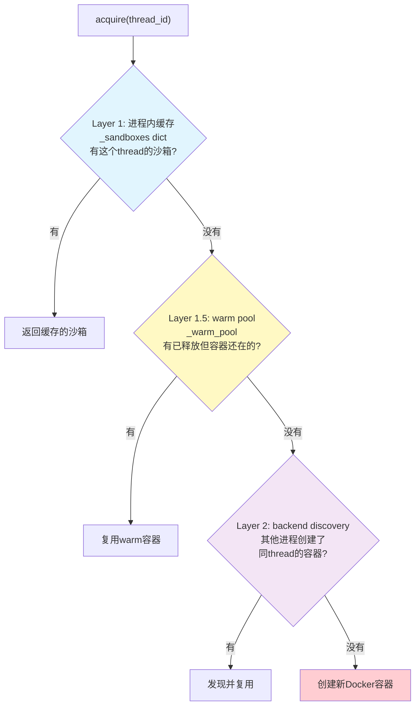

# 第 5 章：沙箱系统 —— Agent 怎么执行代码、读写文件

> **本章目标**：讲透 DeerFlow 的沙箱系统。读完本章，你会理解 Agent 怎么获得隔离的执行环境（Local vs AIO Docker）、虚拟路径怎么映射、6 个沙箱工具（bash/ls/read_file/write_file/str_replace/glob/grep）怎么工作。
>
> 沙箱是 DeerFlow 从"聊天机器人"升级为"能干活的 Agent"的关键——它让 Agent 有了"自己的电脑"。

---

## 5.1 为什么需要沙箱？（设计动机）

没有沙箱的 Agent 只能"说话"——回答问题、生成文本。有了沙箱，Agent 能"做事"——执行代码、读写文件、跑脚本、生成图表。

但"让 LLM 执行系统命令"是巨大的安全风险：
- Agent 可能执行恶意命令（被提示注入攻击）
- Agent 可能读写敏感文件（`/etc/passwd`、用户私钥）
- Agent 可能破坏宿主环境（`rm -rf /`）

**沙箱解决这些问题**：给每个任务一个**隔离的执行环境**，Agent 只能在受限范围内操作。

DeerFlow 支持两种沙箱：
- **LocalSandbox**：在宿主机上用 per-thread 目录隔离（轻量，但不安全——适合可信本地环境）。
- **AioSandbox（Docker）**：每个任务一个 Docker 容器（重量级，但真正隔离——适合生产）。

---

## 5.2 抽象 Sandbox 接口

所有沙箱实现都继承自 `Sandbox` 抽象类：

```python
# 引用位置：backend/packages/harness/deerflow/sandbox/sandbox.py:44-175
class Sandbox(ABC):
    """Abstract base class for sandbox environments"""

    _id: str

    def __init__(self, id: str):
        self._id = id

    @property
    def id(self) -> str:
        return self._id

    @abstractmethod
    def execute_command(self, command: str, env: dict[str, str] | None = None, timeout: float | None = None) -> str:
        """Execute bash command in sandbox."""

    @abstractmethod
    def read_file(self, path: str) -> str:
        """Read the content of a file."""

    @abstractmethod
    def download_file(self, path: str) -> bytes:
        """Download the binary content of a file."""

    @abstractmethod
    def list_dir(self, path: str, max_depth=2) -> list[str]:
        """List the contents of a directory."""

    @abstractmethod
    def write_file(self, path: str, content: str, append: bool = False) -> None:
        """Write content to a file."""

    @abstractmethod
    def glob(self, path: str, pattern: str, *, include_dirs: bool = False, max_results: int = 200) -> tuple[list[str], bool]:
        """Find paths that match a glob pattern under a root directory."""

    @abstractmethod
    def grep(self, path: str, pattern: str, *, glob: str | None = None, literal: bool = False, case_sensitive: bool = False, max_results: int = 100) -> tuple[list[GrepMatch], bool]:
        """Search for matches inside text files under a directory."""

    @abstractmethod
    def update_file(self, path: str, content: bytes) -> None:
        """Update a file with binary content."""
```

**► 8 个抽象方法**覆盖了 Agent 执行任务需要的全部文件/命令操作。`execute_command` 是最强大的（能跑任意 bash），也是风险最高的。

### env 参数的安全设计（防御性编程典范）

```python
# 引用位置：backend/packages/harness/deerflow/sandbox/sandbox.py:6-41
# POSIX env-var name rule: letter or underscore, then letters/digits/underscores.
_ENV_NAME_PATTERN = re.compile(r"^[A-Za-z_][A-Za-z0-9_]*$")

def _validate_extra_env(extra_env: dict[str, str] | None) -> None:
    """Reject ``env`` keys that are not valid POSIX env-var names."""
    if not extra_env:
        return
    for key in extra_env:
        if not isinstance(key, str) or not _ENV_NAME_PATTERN.fullmatch(key):
            raise ValueError(f"extra_env key {key!r} is not a valid POSIX environment variable name...")
```

**► 设计动机深挖**：`execute_command` 的 `env` 参数用于传递请求级环境变量（如短期 token）。**注释极其详细地解释了为什么要校验 key**：

> "今天没有实现把 key 拼接到 shell 字符串里——local sandbox 用 `subprocess.run(env=...)`（不经过 shell），AIO 用结构化的 `env` 字段。但在抽象层强制 POSIX env-name 规则是**纵深防御（defense-in-depth）**：万一未来的实现退化为 shell 拼接，这个校验能防止命令注入。"

**安全设计原则**：即使当前实现没有漏洞，也要为未来的实现预先设防。这是"纵深防御"的精髓。

---

## 5.3 SandboxProvider 协议 —— 沙箱生命周期管理

`Sandbox` 是"一个沙箱实例"，`SandboxProvider` 是"管理和创建沙箱的工厂"：

```python
# 引用位置：backend/packages/harness/deerflow/sandbox/sandbox_provider.py:10-51
class SandboxProvider(ABC):
    """Abstract base class for sandbox providers"""

    uses_thread_data_mounts: bool = False
    needs_upload_permission_adjustment: bool = True

    @abstractmethod
    def acquire(self, thread_id: str | None = None, *, user_id: str | None = None) -> str:
        """Acquire a sandbox environment and return its ID."""

    async def acquire_async(self, thread_id: str | None = None, *, user_id: str | None = None) -> str:
        """Acquire a sandbox without blocking the event loop."""
        return await asyncio.to_thread(self.acquire, thread_id, user_id=user_id)

    @abstractmethod
    def get(self, sandbox_id: str) -> Sandbox | None:
        """Get a sandbox environment by ID."""

    @abstractmethod
    def release(self, sandbox_id: str) -> None:
        """Release a sandbox environment."""
```

**► 注解**：
- **`acquire`/`acquire_async`**：获取沙箱。`acquire_async` 默认用 `asyncio.to_thread` 包装同步的 `acquire`——因为 Docker 操作是阻塞的，不能在 event loop 里跑。
- **`get`**：按 ID 取已获取的沙箱（event-loop-safe 的纯内存查找）。
- **`release`**：释放沙箱（Local 清理引用，AIO 停容器或放回 warm pool）。

### 单例管理 + 线程安全（极其详细的注释）

```python
# 引用位置：backend/packages/harness/deerflow/sandbox/sandbox_provider.py:58-112
_default_sandbox_provider: SandboxProvider | None = None

# Guards every read and write of `_default_sandbox_provider`. The singleton is
# reachable from more than one OS thread (e.g. the main event loop and the Feishu
# channel thread, which runs its own loop), so a bare check-then-create can double
# initialize the provider...
_provider_lock = threading.Lock()

def get_sandbox_provider(**kwargs) -> SandboxProvider:
    """Get the sandbox provider singleton."""
    global _default_sandbox_provider
    # Fast path: a single locked read
    with _provider_lock:
        if _default_sandbox_provider is not None:
            return _default_sandbox_provider

    # Cold start. Resolve + construct outside the lock: the import and the
    # provider constructor are plugin code and must not run under a non-reentrant lock.
    config = get_app_config()
    cls = resolve_class(config.sandbox.use, SandboxProvider)
    provider = cls(**kwargs)

    with _provider_lock:
        if _default_sandbox_provider is None:
            _default_sandbox_provider = provider
            return provider
        # We lost the install race: another thread got there first.
        winner = _default_sandbox_provider

    # Discard the instance we just built. For providers with side-effectful
    # constructors (e.g. AioSandboxProvider starts an idle-checker thread),
    # this tears down the orphan so it does not leak — issue #3721.
    if hasattr(provider, "shutdown"):
        provider.shutdown()
    return winner
```

**► 注解（线程安全设计的典范）**：

- **第 73 行 `_provider_lock`**：单例可达自多个 OS 线程（主 event loop + 飞书渠道线程），裸的"检查然后创建"会双重初始化。

- **第 88-90 行 Fast path（快路径）**：已存在单例时，一次加锁读取就返回——热路径开销最小。

- **第 94-97 行 Cold start 在锁外**：**关键设计**！注释解释：import 和 constructor 是**插件代码**（`config.sandbox.use` 解析到任意类），可能很慢或重入生命周期函数。如果持锁运行它们：(1) 非重入锁会**自死锁**重入的 provider；(2) 慢 teardown 会阻塞所有并发 `get()`。所以**回调代码在锁外运行**。

- **第 99-105 行 双重检查**：在锁内再次检查——因为构造期间另一个线程可能已经创建了。如果输了竞态（`winner` 已存在），返回赢家。

- **第 108-111 行 清理孤儿**：**issue #3721 的修复**。AioSandboxProvider 的 constructor 有副作用（启动 idle-checker 线程）。如果输了竞态，刚建的实例要 `shutdown()` 清理，否则线程泄漏。

---

## 5.4 LocalSandboxProvider —— 本地文件系统沙箱

### 核心设计：per-thread 隔离 + LRU 缓存

```python
# 引用位置：backend/packages/harness/deerflow/sandbox/local/local_sandbox_provider.py (核心逻辑)
DEFAULT_MAX_CACHED_THREAD_SANDBOXES = 256  # LRU 缓存容量
```

**`acquire(thread_id)` 的工作**：
1. 如果 `thread_id=None` → 返回 id 为 `"local"` 的通用单例（给无线程上下文的调用者）。
2. 否则 → 返回 id 为 `"local:{thread_id}"` 的 per-thread LocalSandbox。
3. per-thread 沙箱缓存在 `_thread_sandboxes: OrderedDict`（LRU，容量 256）里。`acquire`/`get` 都会 `move_to_end` 更新 LRU 顺序。超容量时淘汰最久未用的。
4. 所有缓存操作通过 `self._lock` 串行化；I/O 操作（触碰文件系统）刻意在锁外执行，随后在锁内二次检查（double-checked locking）。

### PathMapping —— 虚拟路径映射

`_build_thread_path_mappings` 为每个线程构造映射：
- `/mnt/user-data/workspace` → `{thread_dir}/user-data/workspace`
- `/mnt/user-data/uploads` → `{thread_dir}/user-data/uploads`
- `/mnt/user-data/outputs` → `{thread_dir}/user-data/outputs`
- `/mnt/acp-workspace` → `{thread_dir}/acp-workspace`

这让 Agent 看到的路径是统一的 `/mnt/user-data/*`（虚拟路径），实际读写的是 per-user per-thread 的物理目录。

---

## 5.5 AioSandboxProvider —— Docker 隔离沙箱

### 为什么 AIO 更安全

LocalSandbox 的"隔离"只是**路径层面的**——Agent 执行的 bash 命令还是在宿主机内核上跑，理论上能访问任意文件（路径映射只是"翻译"，不是"沙箱"）。

AioSandbox 给每个任务一个**真正的 Docker 容器**——独立的文件系统、进程空间。即使 Agent 执行恶意命令，也只能影响这个临时容器，碰不到宿主机。

### 三层缓存（极其复杂的设计）

AioSandbox 维护三层缓存来平衡性能和资源：



**► 三层缓存的设计动机**：

- **Layer 1（进程内缓存）**：同进程内，同一个 thread 的后续请求直接复用——最快。
- **Layer 1.5（warm pool）**：run 结束后释放沙箱，但**不停容器**，放回 warm pool。下次同一个 thread 再来，直接复用 warm 容器——省去容器启动时间（Docker 容器启动要几秒）。
- **Layer 2（backend discovery）**：**多进程**场景。多个 Gateway worker 可能为同一个 thread 创建容器。通过 **deterministic sandbox_id**（`sha256(thread_id)[:8]`，跨进程一致），一个 worker 能"发现"另一个 worker 创建的容器并复用。

### 关键机制

- **deterministic sandbox_id**：`sha256(thread_id)[:8]`——跨进程一致，让多 worker 能发现同一容器。
- **跨进程锁**：`_discover_or_create_with_lock` 用文件锁（`{thread_dir}/{sandbox_id}.lock`）串行化同名容器的创建。
- **idle checker**：后台线程每 60s 检查，超过 `idle_timeout`（默认 600s）的活跃/warm 容器被销毁。
- **replicas 容量管理**：soft cap，超过时只淘汰 warm pool 中的最旧容器，**不会强杀活跃容器**。

---

## 5.6 虚拟路径系统（统一的 `/mnt/user-data` 契约）

### 设计目标

Agent 看到的路径永远是 `/mnt/user-data/{workspace,uploads,outputs}` 和 `/mnt/skills`——不管底层是 LocalSandbox 还是 AioSandbox。这叫"**统一的虚拟路径契约**"。

```
Agent 视角（虚拟路径）          物理路径（LocalSandbox）           物理路径（AIO Docker）
/mnt/user-data/workspace  →  users/{uid}/threads/{tid}/         →  容器内 /mnt/user-data/workspace
                                user-data/workspace/                （volume mount 到物理目录）
/mnt/user-data/uploads    →  users/{uid}/threads/{tid}/         →  容器内 /mnt/user-data/uploads
                                user-data/uploads/
/mnt/user-data/outputs    →  users/{uid}/threads/{tid}/         →  容器内 /mnt/user-data/outputs
                                user-data/outputs/
/mnt/skills               →  deer-flow/skills/                  →  容器内 /mnt/skills
```

**► 设计动机**：
- **LocalSandbox**：用 `PathMapping` 在**路径翻译**层面实现——Agent 说"读 `/mnt/user-data/workspace/foo.py`"，LocalSandbox 翻译成"读物理路径"。
- **AioSandbox**：用 **Docker volume mount**——物理目录直接挂载到容器的 `/mnt/user-data/workspace`，容器内路径和虚拟路径一致，**无需翻译**。

### per-user scope

```python
# thread_dir 优先 {base_dir}/users/{user_id}/threads/{thread_id}
```

每个用户的每个线程有独立的文件空间——用户 A 的 Agent 看不到用户 B 的文件。

### ensure_thread_dirs

```python
# 引用位置：backend/packages/harness/deerflow/config/paths.py:315-335
# 创建四个目录并 chmod(0o777)
```

`chmod(0o777)` 是为了让容器内不同 UID 都能写——Docker 容器内的进程可能以非 root 用户运行，如果目录是 755 就写不了。

---

## 5.7 沙箱工具详解

沙箱工具在 `sandbox/tools.py`，它们是 Agent 最常用的工具。每个工具都挂了 `.coroutine` 异步版本。

### bash —— 执行命令

```python
# 引用位置：backend/packages/harness/deerflow/sandbox/tools.py:1394-1447 (核心逻辑)
```

**工作流**：
1. local sandbox 下校验路径（`validate_local_bash_command_paths`）。
2. 替换虚拟路径（`replace_virtual_paths_in_command`）——Agent 说 `/mnt/user-data/workspace`，翻译成物理路径。
3. 加 `cd workspace &&` 前缀——让命令默认在 workspace 目录执行。
4. 执行命令。
5. 输出做 `mask_local_paths_in_output` **反向替换**——命令输出里的物理路径翻译回虚拟路径，让模型看到的是一致的虚拟路径。

**数据流样例**：
```python
# Agent 调用：
bash(command="python analysis.py > /mnt/user-data/outputs/result.txt")

# 翻译后实际执行：
cd /physical/path/workspace && python analysis.py > /physical/path/outputs/result.txt

# 输出（如果有路径）反向翻译：
"Wrote to /mnt/user-data/outputs/result.txt"  # 而非物理路径
```

### read_file —— 读文件

支持 `start_line`/`end_line`（行范围读取），默认截断 50000 字符（`_truncate_read_file_output`）。

### write_file —— 写文件

80KB 单次写入上限（issue #3189，防超大 payload）。`get_file_operation_lock` 串行化同路径写入（防并发写冲突）。支持 `append` 参数。

### str_replace —— 字符串替换

读全文 → 替换 → 写回。`replace_all=False` 时要求 `old_str` **唯一**（多处匹配时报错，防误操作）。

### glob / grep —— 搜索

委托沙箱的 `glob`/`grep` 实现。结果做路径反向映射。

---

## 5.8 沙箱中间件回顾

第 3 章讲的几个中间件和沙箱紧密配合：

| 中间件 | 和沙箱的关系 |
|--------|-------------|
| **SandboxMiddleware** (#6) | 懒获取/释放沙箱，捕获新 sandbox_id 持久化 |
| **SandboxAuditMiddleware** (#10) | 审计 bash 命令，高危拦截 |
| **ReadBeforeWriteMiddleware** (#11) | 写前读校验，防盲写 |
| **ToolOutputBudgetMiddleware** (#2) | bash 大输出外部化到磁盘 |

---

## 5.9 本章小结

沙箱系统的核心设计：

1. **抽象接口**：`Sandbox`（8 个方法）+ `SandboxProvider`（acquire/get/release 生命周期）。
2. **两种实现**：Local（轻量，路径隔离）vs AIO Docker（重量，真正隔离）。通过 `config.yaml` 的 `sandbox.use` 选择。
3. **虚拟路径契约**：Agent 统一看到 `/mnt/user-data/*`，Local 用翻译，AIO 用 volume mount。
4. **per-user per-thread 隔离**：每个用户的每个线程有独立文件空间。
5. **AIO 三层缓存**：进程内 + warm pool + backend discovery，配合 deterministic sandbox_id 和跨进程锁，平衡性能和资源。
6. **安全防御**：host bash 默认不暴露、env key 校验（纵深防御）、高危命令拦截、写前读校验。

**核心思想**：沙箱让 Agent 从"只能说话"变成"能做事"。通过统一的虚拟路径契约，Agent 代码不需要关心底层是 Local 还是 Docker——**可移植性**。通过 per-user per-thread 隔离，多用户多任务互不干扰——**安全性**。

**下一章**：子 Agent 系统——复杂任务怎么分解和委派。
