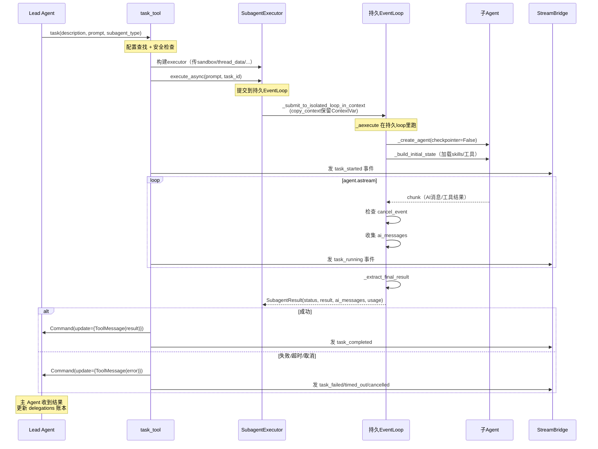

# 第 6 章：子 Agent 系统 —— 复杂任务怎么分解和委派

> **本章目标**：讲透子 Agent 系统。读完本章，你会理解 `task` 工具怎么触发子 Agent、SubagentExecutor 的双线程池 + 持久 event loop 怎么工作、并发怎么控制、委派账本怎么记录、为什么 `checkpointer=False`。

---

## 6.1 为什么需要子 Agent？（设计动机）

复杂任务（比如"调研 X、Y、Z 三个主题并写综合报告"）在一个 Agent 的上下文里完成会出问题：
1. **上下文爆炸**：三个主题的原始资料全塞进一个对话历史，超出上下文窗口。
2. **互相干扰**：研究 X 的中间结果影响研究 Y 的判断。
3. **无法并行**：串行研究三个主题很慢。

子 Agent 解决这些问题：主 Agent（lead agent）把任务**分解**，每个子任务委派给一个**独立上下文**的子 Agent。子 Agent 在自己的隔离上下文里完成工作，只把**最终结果**回传给主 Agent。

```
Lead Agent（主 Agent）
  │
  ├─ task("研究X") → Subagent A（独立上下文）→ "X是..."
  ├─ task("研究Y") → Subagent B（独立上下文）→ "Y是..."  ← 并行！
  └─ task("研究Z") → Subagent C（独立上下文）→ "Z是..."
  │
  ↓ 主 Agent 综合三个结果
"综合报告：X... Y... Z..."
```

**核心价值**：**上下文隔离 + 并行执行**。每个子 Agent 的中间过程不污染主对话，主 Agent 只看到精炼的结果。

---

## 6.2 task 工具 —— 触发子 Agent 的入口

```python
# 引用位置：backend/packages/harness/deerflow/tools/builtins/task_tool.py:228-270
@tool("task", parse_docstring=True)
async def task_tool(
    runtime: Runtime,
    description: str,
    prompt: str,
    subagent_type: str,
    tool_call_id: Annotated[str, InjectedToolCallId],
) -> str | Command:
    """Delegate a task to a specialized subagent that runs in its own context.

    Built-in subagent types:
    - general-purpose: A capable agent for complex, multi-step tasks
    - bash: Command execution specialist for running bash commands

    Args:
        description: A short (3-5 word) description for logging/display.
        prompt: The task description for the subagent.
        subagent_type: The type of subagent to use.
    """
```

**► 注解**：
- **`description`**：3-5 词的简短描述（给前端展示用，如 "研究竞争对手"）。
- **`prompt`**：详细任务说明（给子 Agent 的指令）。
- **`subagent_type`**：用哪种子 Agent（`general-purpose` / `bash` / 自定义）。

### 配置查找 + 安全检查

```python
# 引用位置：backend/packages/harness/deerflow/tools/builtins/task_tool.py:271-292
    config = get_subagent_config(subagent_type, app_config=runtime_app_config)
    if config is None:
        available = ", ".join(available_subagent_names)
        error = f"Unknown subagent type '{subagent_type}'. Available: {available}"
        return _task_result_command(tool_call_id=tool_call_id, status="failed", error=error)
    if subagent_type == "bash":
        host_bash_allowed = is_host_bash_allowed(runtime_app_config)
        if not host_bash_allowed:
            return _task_result_command(tool_call_id=tool_call_id, status="failed", error=LOCAL_BASH_SUBAGENT_DISABLED_MESSAGE)
```

**► 注解**：
- **未知类型 → 友好错误**：返回"Unknown subagent type '{x}'. Available: general-purpose, bash"，列出可用类型——帮模型自我纠正。
- **bash 子 Agent 的安全检查**：只有 host bash 显式允许时才可用，否则返回 disabled 消息。

### 后台执行 + SSE 事件

task 工具是 **async** 的。它调用 `executor.execute_async(prompt)` 后，**轮询**后台任务状态，通过 `get_stream_writer()` 发送 SSE 事件：

```python
# task_tool.py 的核心循环（简化展示）
executor = SubagentExecutor(...)  # 构建 executor
await executor.execute_async(prompt, task_id=tool_call_id)  # 启动后台执行

# 轮询（每5s）
while True:
    result = get_background_task_result(tool_call_id)
    if result is None:
        await asyncio.sleep(5)
        continue
    # 发送 SSE 事件
    if result.status == "running":
        get_stream_writer()("task_running", {...})  # 中间进度
    else:
        break  # 终态

# 返回结果
return _task_result_command(status=result.status, result=result.result, usage=result.usage)
```

**事件流**（前端看到）：
```
task_started      → "子任务开始了"
task_running      → "子任务进行中...（第N条AI消息）"  ← 可能有多次
task_completed    → "子任务完成" / task_failed / task_timed_out
```

### 协作取消

```python
# 引用位置：backend/packages/harness/deerflow/tools/builtins/task_tool.py:440-465
# asyncio.CancelledError 时 request_cancel_background_task
```

用户点"停止"时，主 run 被取消，task 工具捕获 `CancelledError`，请求子 Agent 也取消（协作式取消），shielded 等待终态以报告 token usage。

---

## 6.3 SubagentExecutor —— 双线程池 + 持久 event loop

这是子 Agent 系统最复杂的部分。

### 双线程池设计

```python
# 引用位置：backend/packages/harness/deerflow/subagents/executor.py:143
_scheduler_pool = ThreadPoolExecutor(max_workers=3, ...)  # 调度池

# 持久 isolated event loop（行 148-232）
_isolated_subagent_loop = ...  # 长生命周期的 event loop，跑在 daemon 线程
```

**► 设计动机深挖——为什么需要持久 event loop？**

子 Agent 用 `agent.astream()` 异步执行，需要 event loop。如果每次创建/关闭 loop，会导致 **async 客户端资源泄漏**（HTTP 连接池、SSL context 等）。所以 DeerFlow 创建一个**长生命周期的 event loop**（跑在 daemon 线程里），所有子 Agent 复用它。

### execute_async 的工作流

```python
# 引用位置：backend/packages/harness/deerflow/subagents/executor.py:819-880
def execute_async(self, prompt, task_id=None):
    # 把 _aexecute 通过 _submit_to_isolated_loop_in_context 提交到持久 loop
    # 用 copy_context() 保留 ContextVar
    execution_future = self._submit_to_isolated_loop_in_context(...)
    return execution_future.result(timeout=timeout_seconds)
```

**► 注解**：`_submit_to_isolated_loop_in_context` 用 `copy_context()` 保留 ContextVar——虽然跨线程，但 context 被复制过去，`user_id` 等信息能传播。

### _aexecute 的核心流程

```python
# 引用位置：backend/packages/harness/deerflow/subagents/executor.py:504-737
async def _aexecute(self, prompt, ...):
    # 1. _build_initial_state：加载 skills、过滤工具、组装 deferred tools
    state = self._build_initial_state(...)
    
    # 2. _create_agent：创建子 Agent（checkpointer=False!）
    agent = self._create_agent(...)
    
    # 3. agent.astream 流式执行
    async for chunk in agent.astream(state, config=run_config, context=context, stream_mode="values"):
        if cancel_event.is_set():  # 协作取消检查
            break
        # 收集 AIMessage 到 ai_messages
    
    # 4. 提取最终结果
    result = _extract_final_result(final_state, ...)
    return SubagentResult(status="completed", result=result, ai_messages=ai_messages)
```

### 为什么 checkpointer=False？

```python
# 引用位置：backend/packages/harness/deerflow/subagents/executor.py:369-376
agent = create_agent(..., checkpointer=False)  # 显式禁用 checkpointer
```

**► 设计动机**：
1. **子 Agent 是一次性的**——委派执行完就结束，不需要跨调用恢复状态。
2. **避免污染父线程的 checkpoint**——如果子 Agent 用父 Agent 的 checkpointer，它的消息会写进父线程的 checkpoint 历史，破坏父对话的完整性。
3. 子 Agent 的结果通过 `ai_messages` 和 `result.result` 回传给父 Agent（作为 task 工具的 ToolMessage），不依赖 checkpoint。

### SubagentStatus 状态机

```python
# 引用位置：backend/packages/harness/deerflow/subagents/executor.py:49-66
# PENDING → RUNNING → COMPLETED / FAILED / CANCELLED / TIMED_OUT
```

`try_set_terminal`（第 102-135 行）：保证**终态只设置一次**。后台超时/取消和执行 worker 可能在同一个 result holder 上竞态——第一个终态转换赢，迟到的终态写入不改变状态。这是经典的"first-write-wins"并发控制。

---

## 6.4 内置子 Agent

### general-purpose —— 通用多步骤 Agent

```python
# 引用位置：backend/packages/harness/deerflow/subagents/builtins/general_purpose.py
# tools=None（继承全部工具，除了 task/ask_clarification/present_files）
# model="inherit"（继承主 Agent 的模型）
# max_turns=150（从旧版的 100 提升，防 deep-research 子任务撞 GraphRecursionError）
```

**► 注解**：`max_turns=150` 是个重要的调优——旧版 100 轮经常不够（深度研究子任务可能需要 120+ 轮），导致 `GraphRecursionError` 中断。提升到 150 让子 Agent 有足够空间完成复杂任务。

### bash —— 命令执行专家

```python
# 引用位置：backend/packages/harness/deerflow/subagents/builtins/bash_agent.py
# tools=["bash", "ls", "read_file", "write_file", "str_replace"]（仅沙箱工具）
# max_turns=60
```

专门的命令执行 Agent，只有沙箱工具。只有 host bash 允许时才可用。

---

## 6.5 并发控制 —— 双闸设计

### 闸 1：prompt 软约束

```python
# 引用位置：backend/packages/harness/deerflow/agents/lead_agent/prompt.py (subagent_reminder)
f"**HARD LIMIT: max {n} `task` calls per response.**"
```

系统提示词告诉模型"每次响应最多 N 个 task 调用"。但 LLM 不一定听话。

### 闸 2：SubagentLimitMiddleware 硬截断

```python
# 引用位置：backend/packages/harness/deerflow/agents/middlewares/subagent_limit_middleware.py
# after_model → _truncate_task_calls
# 单次响应 task 调用超过 max_concurrent（clamp [2,4]）→ 保留前 N 个，丢弃多余
```

**代码层面强制截断**。即使模型发起 5 个 task 调用，只有前 N 个（默认 3）被执行，多余的被丢弃。模型下一轮可以重新发起。

### 新增：max_total_subagents（累计上限）

配合目标延续循环——限制**整个 run**累计的子 Agent 总数，防止 Agent 在续轮里无限委派。

---

## 6.6 委派账本（delegations）

第 1 章讲过的 `ThreadState.delegations` 通道。每次 task 调用都会在账本里记一条：

```python
# 引用位置：backend/packages/harness/deerflow/agents/thread_state.py:135-148
class DelegationEntry(TypedDict):
    id: str                      # task tool_call_id
    run_id: NotRequired[str]
    description: str             # "研究竞争对手"
    subagent_type: str           # "general-purpose"
    status: str                  # running/completed/failed
    result_brief: NotRequired[str]  # 结果摘要
    result_sha256: NotRequired[str]
    result_ref: NotRequired[str]
    stop_reason: NotRequired[str]   # token_capped/loop_capped
    created_at: str
```

**数据流样例**：
```python
# 主 Agent 委派子 Agent 研究竞争对手
delegations = [
    {
        "id": "call_abc123",
        "description": "研究竞争对手",
        "subagent_type": "general-purpose",
        "status": "completed",
        "result_brief": "主要竞争对手是A、B、C...",
        "created_at": "2026-07-16T10:00:00Z",
    }
]
```

这个账本配合 `DurableContextMiddleware`（第 3 章 #16）——即使消息历史被摘要压缩，委派记录仍保留在 state channel，子 Agent 的成果不会丢失。`merge_delegations` reducer 有**终态粘性**（第 1 章详讲）和 50 条上限。

---

## 6.7 事件流

task 工具的后台执行会产生一系列 SSE 事件，通过 `get_stream_writer()` 推给前端：

| 事件 | 触发时机 | 内容 |
|------|----------|------|
| `task_started` | 子 Agent 开始执行 | description, subagent_type |
| `task_running` | 每条新 AI 消息 | message_index, total_messages, AI 消息内容 |
| `task_completed` | 成功完成 | result_brief, usage（token 统计） |
| `task_failed` | 执行失败 | error |
| `task_cancelled` | 被取消 | — |
| `task_timed_out` | 超时 | — |

前端用这些事件渲染"子任务卡片"——展示子 Agent 的执行进度和中间步骤。

**_SubagentEventBuffer 批量持久化**（第 1 章详讲）：子 Agent 可能跑 150 轮产生几百个 `task_running` 事件。如果每个都 `event_store.put()`，在 Postgres 上会串行化获取 advisory lock，阻塞 run 自己的消息写入。`_SubagentEventBuffer` 攒 25 条或遇到终态时一次性 `put_batch`——"写聚合"模式。

---

## 6.8 完整流程图



---

## 6.9 本章小结

子 Agent 系统的核心设计：

1. **task 工具**：async，触发子 Agent + 轮询发 SSE 事件 + 协作取消。
2. **双线程池 + 持久 event loop**：避免 async 客户端资源泄漏，所有子 Agent 复用一个长生命周期 loop。
3. **checkpointer=False**：子 Agent 是一次性的，不污染父线程 checkpoint。
4. **并发控制双闸**：prompt 软约束 + SubagentLimitMiddleware 硬截断 + max_total 累计上限。
5. **委派账本**：state channel 持久记录委派历史，配合 DurableContext 防摘要丢失。
6. **SubagentStatus 终态粘性**：first-write-wins，防竞态。

**核心思想**：子 Agent 让 Agent 能处理**超出单上下文窗口**的复杂任务。通过上下文隔离 + 并行执行，主 Agent 只处理精炼结果而非原始资料。委派账本 + 持久上下文让委派成果跨轮存活。这是 DeerFlow 处理"需要几分钟到几小时"的大型任务的基础。

**下一章**：运行时核心 + Gateway——Agent 是怎么被调度执行的，结果怎么传给前端。
