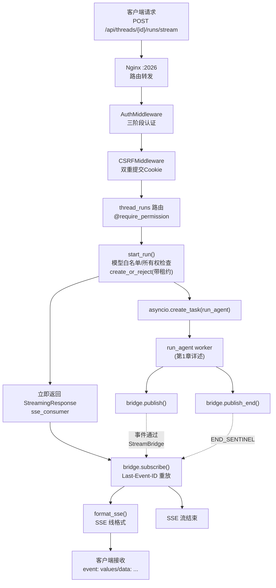

# 第 7 章：运行时核心 + Gateway —— Agent 怎么被调度执行

> **本章目标**：讲透 DeerFlow 的运行时核心。读完本章，你会理解 RunManager（含多 worker 租约/心跳）、StreamBridge（生产消费解耦）、Gateway 路由、认证机制、SSE 流式管道。
>
> **注意**：`run_agent` worker 和 `start_run` 的完整剖析已在第 1 章详讲。本章**不重复**那些内容，而是聚焦于第 1 章没覆盖的部分：RunManager 的多 worker 高可用、StreamBridge 的内部实现、Gateway 的认证和路由。

---

## 7.1 RunManager —— 运行注册表 + 多 worker 高可用

RunManager 是"所有活跃 run 的注册表"。它跟踪每个 run 的状态、归属 worker、租约。

### 核心数据结构

```python
# 引用位置：backend/packages/harness/deerflow/runtime/runs/manager.py:149-184
# RunRecord 包含的关键字段（演进后大幅扩展）：
@dataclass
class RunRecord:
    run_id: str
    thread_id: str
    status: RunStatus           # pending/running/success/error/timeout/interrupted
    assistant_id: str
    model_name: str | None
    # 多 worker 归属（新增）：
    owner_worker_id: str | None  # 哪个worker负责这个run
    lease_expires_at: float | None  # 租约过期时间
    finalizing: bool            # 是否正在收尾
    # token 记账（新增）：
    total_input_tokens: int
    lead_agent_tokens: int
    subagent_tokens: int
    middleware_tokens: int
    token_usage_by_model: dict
    # 终止归因（新增）：
    stop_reason: str | None     # loop_capped/token_capped/safety_capped
    # 基础设施：
    task: asyncio.Task | None   # 后台任务引用
    abort_event: asyncio.Event  # 取消信号
    abort_action: str           # "interrupt" 或 "rollback"
```

### create_or_reject —— 原子性创建 run

```python
# 引用位置：backend/packages/harness/deerflow/runtime/runs/manager.py:920-1086
async def create_or_reject(self, thread_id, assistant_id, *, on_disconnect, metadata, kwargs,
                           multitask_strategy, model_name, user_id) -> RunRecord:
```

**核心变化（相比旧版）**：
- **原子性下沉到 store 层**：旧版是"local check → 本地建 record → persist"。新版改为调 `store.create_run_atomic(...)`——**数据库层面的原子操作**，消除 TOCTOU 竞态。
- **带 `owner_worker_id` 和 `lease_expires_at`**：创建时就标记"这个 run 归当前 worker，租约 N 秒后过期"。
- **interrupt/rollback 路径有 3 次 retry**：处理 unique constraint violation（并发创建竞态）。

### 多 worker 租约/心跳（本次演进的核心！）

这是让 DeerFlow 能在生产环境跑多 worker 的关键机制。

#### 问题背景

```
单 worker 场景：简单，但 worker 崩溃 = 所有 run 丢失
多 worker 场景：高可用，但需要协调"谁负责哪个 run"
```

如果用户在 worker A 创建了 run，重连时连到 worker B，B 怎么知道这个 run？如果 worker A 崩溃了，谁来接管它的 run？

#### 解决方案：lease（租约）+ heartbeat（心跳）

```python
# 引用位置：backend/packages/harness/deerflow/runtime/runs/manager.py:1188-1201
async def start_heartbeat(self) -> None:
    """Start the background lease-renewal task."""
    if not self.heartbeat_enabled:
        return
    if self._heartbeat_task is not None and not self._heartbeat_task.done():
        return
    self._heartbeat_stop = asyncio.Event()
    task = asyncio.create_task(self._heartbeat_loop())
    task.set_name("deerflow-run-lease-heartbeat")
    self._heartbeat_task = task
```

**工作原理**：
1. 每个 run 创建时带 `lease_expires_at`（租约过期时间，比如 30 秒后）。
2. 负责 run 的 worker 定期（每 `lease_seconds / 3`）发心跳**续租**。
3. 如果 worker 崩溃，心跳停止，租约过期。
4. 其他 worker 的**协调循环**（`_reconcile_orphans_periodic`）发现过期租约的 run，**接管**（takeover）。

#### 心跳循环的精巧设计

```python
# 引用位置：backend/packages/harness/deerflow/runtime/runs/manager.py:1222-1260
async def _heartbeat_loop(self) -> None:
    """Periodically renew leases and reclaim orphaned runs from dead peers.

    Lease renewal runs every ``lease_seconds / 3``. Reconciliation
    (sweeping for expired leases owned by dead workers) runs every
    ``lease_seconds`` (every 3rd cycle) so orphaned runs are recovered
    without waiting for a pod restart.

    Both operations are guarded so a transient failure cannot take the
    heartbeat task down — a dead heartbeat means no lease is renewed
    again, and every active run eventually looks orphaned to peers.
    """
    lease_seconds = self._run_ownership_config.lease_seconds
    interval = max(1, lease_seconds // 3)
    cycle = 0

    while not stop.is_set():
        try:
            await asyncio.wait_for(stop.wait(), timeout=interval)
            break  # stop event was set
        except TimeoutError:
            pass  # interval elapsed

        cycle += 1
        try:
            await self._renew_leases()  # 每 lease_seconds/3 续租
            if cycle % 3 == 0:
                await self._reconcile_orphans_periodic()  # 每3个周期协调一次
        except Exception:
            logger.warning(...)  # 守护：瞬态失败不能杀死心跳
```

**► 逐行注解 + 设计动机深挖**：

- **`interval = max(1, lease_seconds // 3)`**：续租间隔 = 租约时长的 1/3。如果租约 30 秒，每 10 秒续租一次——保证在租约过期前有 3 次续租机会（容错）。

- **`cycle % 3 == 0` 协调**：协调（扫描过期租约）每 3 个周期跑一次（即每个租约周期一次）。注释说"without waiting for a pod restart"——旧版要等 pod 重启才能恢复孤儿 run，现在心跳循环主动发现并接管。

- **注释最后一句极其重要**："Both operations are guarded so a transient failure cannot take the heartbeat task down — **a dead heartbeat means no lease is renewed again, and every active run eventually looks orphaned to peers.**"

  **设计动机**：心跳是"生命线"——如果心跳任务死了，租约不再续期，所有 run 都会变成"孤儿"。所以 `try/except` 守护每一次操作——**瞬态失败只记日志，不杀死心跳**。

#### cancel 的新复杂性（lease_valid_elsewhere）

旧版 cancel 返回 `bool`。新版返回 `CancelOutcome` 枚举，新增 `lease_valid_elsewhere` 分支：

```python
# 引用位置：backend/packages/harness/deerflow/runtime/runs/manager.py:762-903
async def cancel(self, run_id, *, action="interrupt") -> CancelOutcome:
    # ... 本机有 record → 正常取消 ...
    # 本机没有 record → 查 store
    #   lease 过期 → claim_for_takeover 抢占
    #   lease 未过期 → 返回 lease_valid_elsewhere（409 + Retry-After）
```

**► 注解**：如果用户要取消的 run 不在当前 worker（在另一个 worker），当前 worker 检查租约：
- 租约过期 → 直接抢占接管并取消。
- 租约未过期 → 返回 `lease_valid_elsewhere`，HTTP 层转成 **409 + Retry-After** header，告诉客户端"稍后重试"。

---

## 7.2 StreamBridge —— 生产消费解耦

### 为什么需要 Bridge？

`run_agent` worker（生产者）产出事件，SSE consumer（消费者）把事件推给浏览器。如果不解耦：
- worker 必须等 consumer 准备好才能产出——耦合。
- 客户端断线重连后，错过的事件怎么补？

StreamBridge 解耦了两者：worker 只管 `bridge.publish()`，consumer 通过 `bridge.subscribe()` 订阅。

### 抽象接口

```python
# 引用位置：backend/packages/harness/deerflow/runtime/stream_bridge/base.py:37-73
class StreamBridge(ABC):
    @abstractmethod
    async def publish(self, run_id: str, event: str, data: Any) -> None:
        """发布一个事件到指定 run 的流"""

    @abstractmethod
    async def publish_end(self, run_id: str) -> None:
        """标记 run 的流结束"""

    @abstractmethod
    async def subscribe(self, run_id: str, *, last_event_id: str | None = None,
                        heartbeat_interval: float = 15.0) -> AsyncIterator[StreamEvent]:
        """订阅 run 的流，支持从 last_event_id 重放"""
```

### MemoryStreamBridge —— 进程内实现

```python
# 引用位置：backend/packages/harness/deerflow/runtime/stream_bridge/memory.py:25-120
class MemoryStreamBridge(StreamBridge):
    """Per-run in-memory event log implementation.

    Events are retained for a bounded time window per run so late subscribers
    and reconnecting clients can replay buffered events from ``Last-Event-ID``.
    """

    def __init__(self, *, queue_maxsize: int = 256) -> None:
        self._maxsize = queue_maxsize  # 每个 run 保留 256 个事件
        self._streams: dict[str, _RunStream] = {}
```

#### _RunStream —— 每个 run 一个事件流

```python
# 引用位置：backend/packages/harness/deerflow/runtime/stream_bridge/memory.py:17-22
@dataclass
class _RunStream:
    events: list[StreamEvent] = field(default_factory=list)
    condition: asyncio.Condition = field(default_factory=asyncio.Condition)  # 通知订阅者
    ended: bool = False       # 是否已结束
    start_offset: int = 0     # 事件淘汰后的偏移量
```

#### publish —— 发布事件

```python
# 引用位置：backend/packages/harness/deerflow/runtime/stream_bridge/memory.py:95-104
async def publish(self, run_id: str, event: str, data: Any) -> None:
    stream = self._get_or_create_stream(run_id)
    entry = StreamEvent(id=self._next_id(run_id), event=event, data=data)
    async with stream.condition:
        stream.events.append(entry)
        if len(stream.events) > self._maxsize:
            overflow = len(stream.events) - self._maxsize
            del stream.events[:overflow]           # 淘汰最旧事件
            stream.start_offset += overflow         # 更新偏移量
        stream.condition.notify_all()               # 通知等待的订阅者
```

**► 注解**：
- **有界事件日志**（256 个事件）：防止长 run 的事件无限积累。超过时淘汰最旧的，但更新 `start_offset`——订阅者通过 `Last-Event-ID` 知道自己漏了哪些。
- **`condition.notify_all()`**：异步条件变量，通知所有等待的 subscribe 协程"有新事件了"。

#### subscribe + Last-Event-ID 重放

```python
# 引用位置：backend/packages/harness/deerflow/runtime/stream_bridge/memory.py:67-87
def _resolve_start_offset(self, stream: _RunStream, last_event_id: str | None) -> int:
    if last_event_id is None:
        return stream.start_offset

    # Event ids embed a per-run, monotonically increasing ``seq`` that equals
    # the event's absolute offset, so locate the event by arithmetic in O(1)
    # rather than scanning the retained buffer.
    seq = self._parse_event_seq(last_event_id)
    if seq is not None:
        local_index = seq - stream.start_offset
        if 0 <= local_index < len(stream.events) and stream.events[local_index].id == last_event_id:
            return stream.start_offset + local_index + 1  # 从下一个事件开始

    # 找不到 → 从最早的保留事件重放
    return stream.start_offset
```

**► 注解（O(1) 重放定位）**：
- 事件 ID 格式是 `{ts}-{seq}`，`seq` 是单调递增的序号。
- 重连时客户端带 `Last-Event-ID`，bridge 通过**算术**（`seq - start_offset`）O(1) 定位重放位置——不用扫描整个缓冲。
- 如果 `Last-Event-ID` 对应的事件已被淘汰，从最早的保留事件重放（降级但不丢当前可用的事件）。

### Redis StreamBridge（生产环境）

`MemoryStreamBridge` 是进程内的——只适用于单 worker。多 worker 场景用 `RedisStreamBridge`：事件存 Redis，多个 worker 都能 publish/subscribe 同一个 run 的流。本次演进增加了 Redis 重连和 stream retention recovery（issue #3933, #4012）。

---

## 7.3 Gateway 认证机制

### AuthMiddleware —— 三阶段故障安全

第 1 章已概述。这里补充安全设计细节：

```python
# 引用位置：backend/app/gateway/auth_middleware.py:62
class AuthMiddleware(BaseHTTPMiddleware):
    # 三阶段调度（行 89-133）：
    #   1. 内部 token (X-DeerFlow-* header)
    #   2. access_token cookie (严格 JWT 验证)
    #   3. is_auth_disabled() 回退
    # 成功时 set_current_user(user) 写入 ContextVar
```

**关键安全点**：
- **故障安全（fail-safe）**：默认拒绝，只有明确验证通过才放行。
- **严格 JWT**：拒绝无效/过期 token，关闭"垃圾 cookie 绕过"。
- **内部 token 单独通道**：IM 渠道 worker 用 `X-DeerFlow-*` header 认证，不走 cookie——因为 worker 不是浏览器，没有 cookie。

### CSRFMiddleware —— 双重提交 Cookie

```python
# 引用位置：backend/app/gateway/csrf_middleware.py:179
class CSRFMiddleware(BaseHTTPMiddleware):
    # 双重提交 Cookie 模式：
    #   POST/PUT/DELETE/PATCH 需要 csrf_token cookie == X-CSRF-Token header
    #   用 secrets.compare_digest 比较（防时序攻击）
    #   Auth 端点豁免 token 检查，但需要 is_allowed_auth_origin（防登录 CSRF）
```

---

## 7.4 Gateway 路由总览

### 路由分类

```python
# 引用位置：backend/app/gateway/app.py:344-553 (create_app)
# 路由按功能分类（本次新增多个）：

# 核心 Agent 运行：
thread_runs.router       # /api/threads/{id}/runs/* — 创建/取消/流式 run
runs.router              # /api/runs/* — 无状态 run（新增 #4177）

# 管理类 API：
models.router            # /api/models — 模型白名单
mcp.router               # /api/mcp — MCP 服务器管理
memory.router            # /api/memory — 记忆 CRUD
skills.router            # /api/skills — 技能管理
uploads.router           # /api/threads/{id}/uploads — 文件上传
threads.router           # /api/threads — 线程管理
artifacts.router         # /api/threads/{id}/artifacts — 产物下载
agents.router            # /api/agents — 自定义 Agent CRUD
suggestions.router       # /api/suggestions — 后续问题建议
feedback.router          # /api/threads/{id}/runs/{id}/feedback — 反馈

# 渠道与集成：
channels.router          # /api/channels — IM 渠道状态
channel_connections.router  # /api/channels/connections — 用户渠道绑定

# 本次新增：
console.router           # /api/console — 控制台（新增）
scheduled_tasks.router   # /api/scheduled_tasks — 定时任务（新增）
github_webhooks.router   # GitHub Webhook（新增）
input_polish.router      # /api/input-polish — 输入润色（新增）
features.router          # /api/features — 功能开关（新增）

# 认证与兼容：
auth.router              # /api/v1/auth — 认证端点
assistants_compat.router # /api/assistants — LangGraph Platform 兼容
```

### SSE 流式端点

```python
# 引用位置：backend/app/gateway/routers/thread_runs.py:496
@router.post("/{thread_id}/runs/stream")
```

第 1 章已详述 `start_run` 的流程。这里补充 SSE consumer 端：

```python
# 引用位置：backend/app/gateway/services.py:793 (sse_consumer)
async def sse_consumer(...):
    """SSE 异步生成器：从 StreamBridge 订阅事件，转成 SSE 格式推给浏览器"""
    last_event_id = request.headers.get("Last-Event-ID")  # 断线重连用
    async for event in bridge.subscribe(run_id, last_event_id=last_event_id):
        if await request.is_disconnected():
            break  # 客户端断开
        if event is END_SENTINEL:
            break  # run 结束
        yield format_sse(event)  # 转 SSE 线格式
    # finally：断开语义——如果 on_disconnect==cancel，取消 run
```

**SSE 线格式**（`format_sse`）：
```
event: metadata
data: {"run_id": "...", "thread_id": "..."}

event: values
data: {"messages": [...]}

```

这个格式和官方 LangGraph Platform 的 `useStream` hook 完全一致——前端 SDK 无缝对接。

### 断开语义（DisconnectMode）

```python
# 引用位置：backend/app/gateway/services.py:827-835 (sse_consumer 的 finally)
# finally:
#   if task still pending/running and on_disconnect == "cancel":
#       cancel the run
```

用户关浏览器时：
- `cancel`（默认）：取消后台 run。
- `continue_`：run 继续在后台跑（用户可以重连看结果）。

---

## 7.5 LangGraph 兼容层

Gateway **直接在原生路径上镜像了 LangGraph Platform API**：

| Gateway 路径 | LangGraph Platform 对应 |
|-------------|----------------------|
| `/api/threads/{id}/runs/stream` | `client.runs.stream()` |
| `/api/threads/{id}/runs/wait` | `client.runs.wait()` |
| `/api/threads/{id}/runs/{id}/join` | SSE 重连 |
| `/api/assistants/*` | `client.assistants.*` |

这让前端的 LangGraph React SDK（`useStream` hook）能**无缝对接**——它以为自己连的是官方 LangGraph Platform，实际连的是 DeerFlow Gateway。

`assistants_compat.py` 提供 LangGraph Platform 助手 API 的 stub（search/get/graph/schemas），满足 SDK 初始化需求。

---

## 7.6 启动流程（lifespan）

```python
# 引用位置：backend/app/gateway/app.py:171 (lifespan)
async def lifespan(app):
    # 1. 加载 startup_config（本地快照，不缓存到 app.state）
    # 2. [新] Monocle tracing 初始化（#4024）
    # 3. [新] tiktoken 预热（规避首请求 BPE 下载 #3402）
    # 4. [新] 清理陈旧 upload staging 文件
    # 5. async with langgraph_runtime(app, startup_config):
    #      引导 StreamBridge/RunManager/checkpointer/store/event_store
    #      [新] 启动 RunManager 心跳（多 worker）
    #      [新] 运行孤儿协调（恢复崩溃 worker 的 run）
    # 6. _ensure_admin_user（首次启动处理）
    # 7. 启动 channel service（IM 渠道）
    # 8. [新] 启动 ScheduledTaskService（定时任务）
    
    yield  # 应用运行
    
    # shutdown:
    #   bounded stop_channel_service
    #   stop scheduled_task_service
    #   [新] memory 队列 flush（#4181，含 K8s grace period 说明）
    #   RunManager shutdown（排空运行中的 run，5s 超时）
```

**► 注解**：
- **`startup_config` 不缓存到 `app.state`**：请求时的配置解析始终走 `get_app_config()`——保证 `config.yaml` 的热重载生效。
- **tiktoken 预热**：避免第一个记忆注入请求触发 BPE 数据下载（可能阻塞很久）。
- **shutdown 的 memory flush**：K8s 的 `terminationGracePeriodSeconds` 默认 30 秒，但 memory 队列 flush 可能需要更久——注释详细说明了这个权衡。

---

## 7.7 完整的请求→执行→响应流程（总览）

把第 1 章和本章的内容合起来，一个完整的请求流程：



---

## 7.8 本章小结

运行时核心 + Gateway 的核心设计：

1. **RunManager**：运行注册表 + 多 worker 租约/心跳。lease + heartbeat 让多 worker 协调归属，崩溃 worker 的 run 能被接管。心跳是生命线，瞬态失败不杀死心跳。
2. **StreamBridge**：生产消费解耦。MemoryStreamBridge（进程内，256 事件有界日志）+ RedisStreamBridge（多 worker）。O(1) 重放定位（通过 event ID 的 seq 算术）。
3. **Gateway 认证**：AuthMiddleware 三阶段故障安全 + CSRFMiddleware 双重提交 Cookie。
4. **SSE 流式**：`sse_consumer` 订阅 StreamBridge，转 SSE 格式推给浏览器。Last-Event-ID 支持断线重连。DisconnectMode 决定断开行为。
5. **LangGraph 兼容**：原生路径镜像 LangGraph Platform API，前端 SDK 无缝对接。
6. **启动流程**：lifespan 引导所有单例，含心跳启动、孤儿协调、tiktoken 预热、定时任务。

**核心思想**：Gateway 是 Agent 运行时的"HTTP 壳"——认证、路由、SSE 流式都是围绕"安全地暴露 harness 能力"设计的。多 worker 高可用通过租约/心跳实现，是生产部署的基础。StreamBridge 解耦让 worker 和 HTTP 响应独立运作——Agent 执行几分钟，HTTP 流式持续推送，互不阻塞。

**下一章**：记忆/技能/MCP/模型工厂——Agent 的"记忆"和"扩展能力"。
