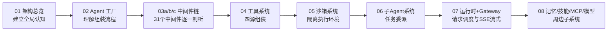
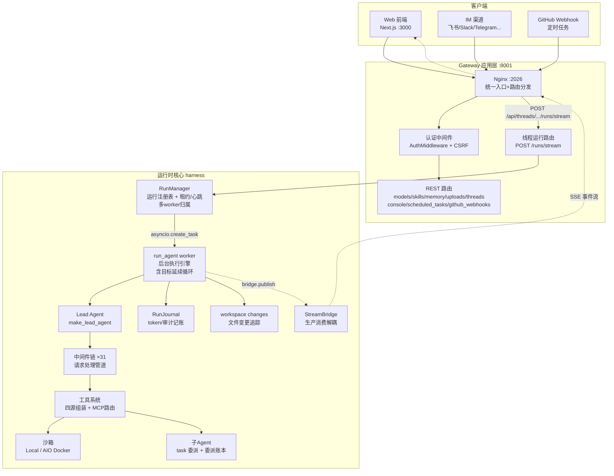

# DeerFlow 2.0 后端 Agent 设计说明书

> **文档定位**：这是一份**教科书式的代码讲解手册**。目标不是给你一份"代码索引"，而是让你**只读这份文档、不看源码**，就能完全理解整个 Agent 的运行逻辑——每个功能点为什么这样设计、关键代码逐块在做什么、数据如何流转。
>
> 所有代码引用都标注了 `file_path:line_number`，可点击跳转到源码核对。

---

## 这份文档是写给谁的

- 想深入理解 DeerFlow Agent 内部机制的**开发者**
- 准备做**二次开发或贡献代码**的工程师
- 不满足于"会用"，还想搞懂"为什么这么设计"的人

如果你只是想快速上手使用 DeerFlow，请先看根目录的 [README.md](../../../README.md)。这份文档假设你已经能跑起项目，现在想钻进引擎盖里看个究竟。

---

## 阅读路线图



**建议第一次阅读按顺序 01 → 08**，因为后面的内容依赖前面的概念。

如果你时间有限，**01 + 02 + 03 是必读的核心三章**，它们覆盖了 Agent 运行逻辑的 80%。

---

## 分册目录

| 分册 | 内容 | 核心问题 |
|------|------|----------|
| **[01 架构总览](./01-architecture-overview.md)** | 项目定位、Harness/App 分层、端口拓扑、请求生命周期（含目标自动延续）、ThreadState 13 个通道 | "一个请求从进来到出去经历了什么？" |
| **[02 Agent 工厂](./02-agent-factory.md)** | `make_lead_agent` 组装流程：模型解析、工具加载（含 MCP routing）、提示词生成、`create_agent` 调用 | "Agent 是怎么被造出来的？" |
| **[03a 中间件·基础层](./03a-middlewares-base.md)** | 中间件机制（hook/reverse dispatch）+ 基础层 #1-#13（输入净化、输出预算、结果消毒、沙箱、错误处理、ReadBeforeWrite、ToolProgress 等） | "请求在 Agent 内部怎么被一步步处理？" |
| **[03b 中间件·上下文层](./03b-middlewares-context.md)** | 上下文技能层 #14-#23（DynamicContext 的 ID-swap 技术、SkillActivation、DurableContext、Summarization、Todo、McpRouting 等） | "模型看到的内容是怎么动态调整的？" |
| **[03c 中间件·安全层](./03c-middlewares-safety.md)** | 安全限流层 #24-#31（DeferredToolFilter、SystemMessageCoalescing、LoopDetection、TokenBudget、TerminalResponse、SafetyFinishReason、Clarification 等） | "怎么防止 Agent 失控？" |
| **[04 工具系统](./04-tools-system.md)** | `get_available_tools` 四源组装、内置/社区/ACP 工具、去重与过滤 | "Agent 手里有哪些工具？怎么来的？" |
| **[05 沙箱系统](./05-sandbox.md)** | 抽象接口、Local vs AIO 两种实现、虚拟路径映射、6 个沙箱工具 | "Agent 怎么执行代码、读写文件？" |
| **[06 子 Agent 系统](./06-subagents.md)** | `task` 工具、SubagentExecutor 双线程池、并发控制、事件流、委派账本 | "复杂任务怎么分解和委派？" |
| **[07 运行时 + Gateway](./07-runtime-gateway.md)** | RunManager（含多 worker 租约/心跳）、`run_agent` worker（含目标延续循环）、StreamBridge、Gateway 路由、认证、SSE 流式 | "Agent 是怎么被调度执行的？结果怎么传给前端？" |
| **[08 记忆/技能/MCP/模型](./08-memory-skills-mcp-models.md)** | 记忆系统（含 per-fact 有效期）、技能系统、MCP 集成、模型工厂 | "Agent 的'记忆'和'扩展能力'怎么实现？" |

---

## 阅读约定

### 代码注解格式

本系列文档采用统一的注解格式。你会大量看到这样的结构：

````
```python
# 引用位置：backend/packages/harness/deerflow/agents/middlewares/tool_error_handling_middleware.py:178-182
middlewares = [
    InputSanitizationMiddleware(),           # 最外层
    ToolOutputBudgetMiddleware.from_app_config(app_config),
    ToolResultSanitizationMiddleware(),
]
```

**► 注解**
- **第 178 行**：`InputSanitizationMiddleware` 排在第一位是有意为之——LangChain 中间件 `wrap_model_call` 按**反向顺序**执行，排第一的中间件是最外层 wrapper……
````

- 每个代码块顶部标注**精确的源码位置**（`file_path:line_number`）
- **► 注解** 部分逐块（甚至逐行）解释这段代码在做什么、为什么这么写
- 关注**设计意图**（"为什么"），而不只是描述行为（"做了什么"）

### 术语

技术术语保留英文原词，避免翻译造成的歧义：middleware、checkpointer、reducer、hook、provider、SSE、lease、heartbeat 等。

### 路径约定

- 代码引用的路径都是**相对于项目根目录** `deer-flow/` 的
- 核心代码集中在 `backend/packages/harness/deerflow/`（简称 **harness**）
- 应用层代码在 `backend/app/`（简称 **app**）

---

## 一张图看懂全貌

在看细节之前，先记住这张全景图。后续每个分册都是在展开其中的某个部分：



**一句话概括流程**：客户端发请求 → Nginx 路由 → Gateway 认证 → 创建 Run（带租约） → 后台 worker 调用 Agent 工厂造出带 31 个中间件的 Agent → Agent 调用工具/沙箱/子 Agent 产出结果 → 可选的目标延续循环判断是否达成目标 → 结果经 StreamBridge 转成 SSE 流式推回客户端，同时 RunJournal 记账 token、workspace changes 追踪文件变更。

接下来的分册会逐一拆解这张图的每个方框。

---

## 版本与准确性说明

- 本文档基于 **DeerFlow 2.0** 主分支（HEAD `b3a0dac8`，2026-07-16 同步）
- **重要演进**：相比早期版本，本次同步包含三大架构升级：
  1. **中间件 24 → 31 个**（新增 DurableContext、McpRouting、ReadBeforeWrite、SystemMessageCoalescing、TerminalResponse、ToolProgress、ToolResultSanitization）
  2. **多 worker 高可用**：RunManager 新增 lease/heartbeat/takeover 机制，支持生产级多 worker 部署
  3. **目标自动延续**：worker 在用户可见 turn 后自动跑隐藏的 goal-evaluator 续轮，让 Agent 自主判断目标是否达成
  4. **可观测性增强**：RunJournal（token/审计记账）、workspace changes（文件变更追踪）、stop_reason 归因
- 代码会持续演进，若发现文档与代码不符，请以代码为准并欢迎提 PR 更新文档
